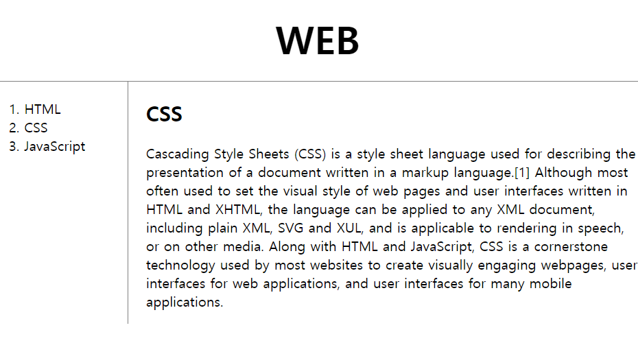
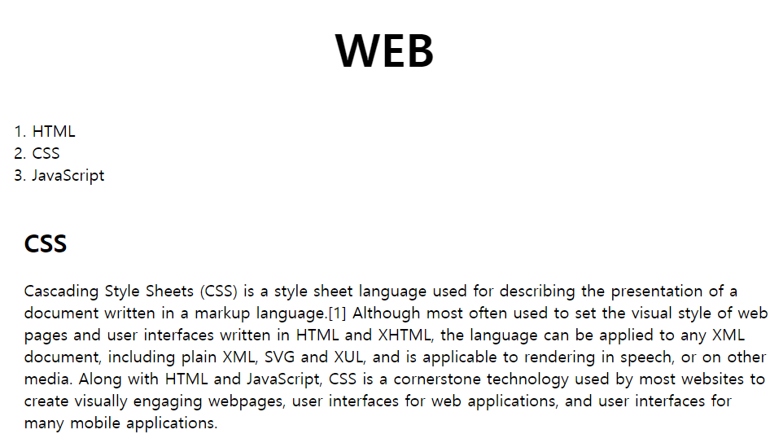

# CSS 2
이전 시간에는 CSS에 대해서 이론을 알아보고, 기본적인 속성들을 배워봤습니다.  
하지만 이것만 가지고는 다양한 해상도의 화면에서, 혹은 더욱 많은 효과를 주기 어렵습니다.  
이번 시간에는 CSS의 애니메이션 속성과 반응형 웹에대해서 알아보겠습니다.  

## 1. 호버링
우리가 사용하는 많은 웹페이지에서 특정 버튼에 마우스 커서를 올리면 버튼이 움직이거나 색이 변하는것을 볼 수 있는데,  
이것을 CSS의 호버링 속성을 통해 지정해 줄 수 있습니다.  
예시를 보면서 따라해 봅시다.  

### 1-1. CSS를 활용하여 동적 메뉴 버튼 만들기  
메뉴바를 만들어 메뉴바의 버튼 위에 마우스를 올렸을 때, 버튼들이 움직이고 색이 변하는 것을 만들어 보겠습니다.  
먼저 html을 통해 틀을 만들어 줍니다.  

```HTML
<nav>
    <ul>
        <li><a href="'#">상의</a></li>
        <li><a href="'#">하의</a></li>
        <li><a href="'#">모자</a></li>
        <li><a href="'#">신발</a></li>
</ul>
</nav>
```
위처럼 HTML 문서를 작성하면 리스트만 덜렁 나오게 될 것입니다.  
메뉴 바처럼 만들어주기 위해 기본 태그들의 css 속성을 초기화 헤줍니다.
```css
html, body{
    margin: 0;
    padding: 0;
}
ul{
    list-style: none;
}
a{
    text-decoration: none;
}
```

다음에는 추가적인 속성을 입혀 메뉴 버튼 디자인 작업을 해줍니다.
```css
a{
    text-decoration: none;
    color: #eeeeee;
    font-size: 20px;
    text-transform: uppercase; /*대문자*/
}
li{
    width: 250px;
    background-color: #111111;
    padding: 25px;
    border-top: solid 4px #ececec;
}
```
디자인 작업이 끝났으면 `transition` 속성을 이용해서  
마우스 포인터를 메뉴 버튼 위에 올려놓으면(호버링) 메뉴 버튼 왼쪽에 마진을 넣어 주어서  
살짝 움직이도록 만들어줍니다. 그리고 버튼의 색도 빨간색으로 바꿔줍니다.  

```
li{
    width: 250px;
    background-color: #111111;
    padding: 25px;
    border-top: solid 4px #ececec;
    transition: background-color 0.4s, margin-left 1s;
}

li:hover{
    background-color: red;
    margin-left: 15px;
}
```
#### transition?
css의 `transition`속성은 대상에 변화가 있을때, 원하는 속도로 변화시켜주는 속성이라 생각하면 됩니다.  
위 코드에서 보면 `background-color`는 0.4초, `margin-left`속성은 1초 동안 변화하도록 설정했습니다.


## 2. 애니메이션
위에서 만들어본 것보다 더 본격적인 애니메이션 효과도 줄 수 있습니다.  
눈이 내리는 효과라던지, 별이 반짝이는 효과 등을 만들수도 있죠.  
간단한 예제를 따라해보면서 `animation`속성에 대해서 배워봅시다.  

### 2-1. 사각형 움직이기
이번에도 먼저 html과 css를 통해서 박스를 만들어 줍니다.  
```html
<body>
<div>DIV 1</div>
</body>
```  
간단하게 `DIV 1`이 적힌 박스 하나를 만들어 줍니다.  
그리고 css를 통해 이 `div`박스가 정말 박스처럼 보이게 적당히 꾸며줍시다

```
div {
  text-align: center;
  width: 100px;
  height: 100px;
  background-color: red;
}
```  
이제 `animation`속성을 넣어서 박스가 움직이도록 해줍시다.  
```
@keyframes example {
  0%   {top:0px; left:0px;}
  25%  {top:0px; left:200px;}
  50%  {top:200px; left:200px;}
  75%  {top:200px; left:0px;}
  100% {top:0px; left:0px;}
}
div {
  text-align: center;
  width: 100px;
  height: 100px;
  background-color: red;
  position: relative;
  animation-name: example;
  animation-duration: 5s;
  animation-iteration-count: infinite;
}
```  
`@keyframes`를 통해서 `example`이라는 이름의 애니메이션을 만들어줍니다.  
이 애니메이션은 `0%`즉, 시작할 때는 왼쪽 위 `(0,0)`지점에서 시작해서  `200px`씩 사각형으로 이동 한 후,  
`100%`, 애니메이션이 끝날 떄는 다시 `(0,0)`지점으로 되돌아오는 애니메이션입니다.  

이제 `div`에 이 애니메이션을 적용합니다.  
먼저 박스가 움직이도록 `position: relative`속성을 넣어줍니다.  
위에서 만든 `example`이라는 애니메이션을 적용해주고 애니메이션 시간은 5초, 무한히 반복하도록 만들었습니다.  

이제 페이지로 들어가서 확인해봅시다. 움직이는게 보이시나요?

### 2-2. 모양과 색상이 바뀌며 움직이기 
이제 조금만 더 나아가 봅시다. 모양과 색상도 바꿔주도록 합시다.  
```
@keyframes example {
  0%   {top:0px; left:0px; background-color: red;}
  25%  {top:0px; left:200px; background-color: green; border-radius:50%;}
  50%  {top:200px; left:200px; background-color: yellow; border-radius:0%;}
  75%  {top:200px; left:0px; background-color: blue; border-radius:50%;}
  100% {top:0px; left:0px; background-color: red; border-radius:0%;}
}
```  
애니메이션만 바꿔줬습니다.  
먼저 `background-color`속성을 통해 박스의 색상을 빨강에서 초록, 노랑, 파랑 그리고 다시 빨강의 순서로 바뀌도록 했습니다.  
그리고 `border-radius`속성을 사용해서 네모난 박스에서 원형이 되도록 바꿔주었습니다.  

이제 애니메이션에 대해서 감이 오시나요?  
여기서 만족하시면 안됩니다. 세상에는 정말 대단한 사람이 많거든요 ㅎㅎ
더 다양하고 예쁜 효과를 만들어보고 싶다면 [이 곳](https://ldrerin.tistory.com/397)을 보면서 공부하시길 바랍니다.  

## 3. 그리드
### 3-1. 그리드 레이아웃이란?
1. 화면을 바둑판 형식으로 나누고 그에따라 배치를 하는 것입니다.
2. 장점:편리하고 손쉽게 다양한 레이아웃 표현할 수 있습니다.
3. 단점:브라우저 호환성을 고려 해야합니다.   

### 3-2. 요소를 나란히 배치하기 
`코드설명`
1. 부모 박스가 그리드 박스의 역할을 담당하므로 자식 요소를 감싸는 부모 박스를 만들어줘야 합니다. 부모와 자식의 구분을 위해 부모 박스에 grid라는 id값을 주었습니다.
2. 부모 박스를 자식 박스와 구별하기 위해 서로 다른 색상의 테두리를 그려줬습니다. (부모는 분홍색 자식은 회색)
3. 본격적으로 그리드 레이아웃을 위해 `display`를 `grid`로 설정합니다. (여기까지만 해서는 아무 변화가 없습니다.)
4. 자식 박스를 나란히 배치하기 위해 `grid-template-columns` 값을 설정해줍니다. 아래 예제에서는 왼쪽 영역은 150px로 고정하고 오른쪽 영역은 1fr로 설정했습니다. (fr은 그리드 컨테이너의 비율입니다. 창 크기에 따라 가변적으로 변합니다.)

```html
<!DOCTYPE html>
<html>
  <head>
    <meta charset="utf-8">
    <title></title>
    <style>
      #grid{
        border:5px solid pink;
        display:grid;
        grid-template-columns: 150px 1fr;
      }
      div{
        border:5px solid gray;
      }
    </style>
  </head>
  <body>
    <div id="grid">
      <div>NAVIGATION</div>
      <div>Lorem ipsum dolor sit amet, consectetur adipisicing elit, sed do eiusmod tempor incididunt ut labore et dolore magna aliqua. Ut enim ad minim veniam, quis nostrud exercitation ullamco laboris nisi ut aliquip ex ea commodo consequat. Duis aute irure dolor in reprehenderit in voluptate velit esse cillum dolore eu fugiat nulla pariatur. Excepteur sint occaecat cupidatat non proident, sunt in culpa qui officia deserunt mollit anim id est laborum.</div>
    </div>
  </body>
</html>
```


### 3-3. 본격적으로 그리드 사용해보기
-> ol태그와 h2,p태그를 나란히 배치해 보자
`코드설명`
1. h2태그와 p태그를 div태그를 사용하여 묶어줍니다. (CSS부분)
2. ol태그와 h2 & p태그를 나란히 배치하기 위해 그리드 레이아웃을 사용합니다. div태그로 묶어 부모 박스를 만들어줍시다.
3. `display`를 `grid`로 설정하고 `grid-template-columns` 값을 설정해줍니다.
```html
<!doctype html>
<html>
<head>
  <title>WEB - CSS</title>
  <meta charset="utf-8">
  <style>
    body{
      margin:0;
    }
    a {
      color:black;
      text-decoration: none;
    }
    h1 {
      font-size:45px;
      text-align: center;
      border-bottom:1px solid gray;
      margin:0;
      padding:20px;
    }
    ol{
      border-right:1px solid gray;
      width:100px;
      margin:0;
      padding:20px;
    }
    #grid{
      display: grid;
      grid-template-columns: 150px 1fr;
    }
    #grid ol{
      padding-left:33px;
    }
    #grid #article{
      padding-left:25px;
    }
  </style>
</head>
<body>
  <h1><a href="index.html">WEB</a></h1>
  <div id="grid">
    <ol>
      <li><a href="1.html">HTML</a></li>
      <li><a href="2.html">CSS</a></li>
      <li><a href="3.html">JavaScript</a></li>
    </ol>
    <div id="article">
        <h2>CSS</h2>
        <p>
          Cascading Style Sheets (CSS) is a style sheet language used for describing the presentation of a document written in a markup language.[1] Although most often used to set the visual style of web pages and user interfaces written in HTML and XHTML, the language can be applied to any XML document, including plain XML, SVG and XUL, and is applicable to rendering in speech, or on other media. Along with HTML and JavaScript, CSS is a cornerstone technology used by most websites to create visually engaging webpages, user interfaces for web applications, and user interfaces for many mobile applications.
        </p>
      </div>
  </div>
  </body>
  </html>
```


## 4. 반응형 디자인
### 4-1. 반응형 디자인이란? 
1. 화면의 크기에따라 웹페이지의 요소들이 바뀌는 것입니다.   
2. 핸드폰,태블릿,데스크탑등 화면의 크기에 따라 웹페이지의 배치가 달라집니다.

### 4-2. 미디어쿼리 
1. 특정 조건을 만족할때만 css를 적용하는 문법입니다.
2. @media(조건)형식으로 사용하고 조건에는 주로 화면 크기와 관련된 내용이 들어갑니다.
3. 예를들어 max-width:800px -> 화면 크기가 800px이하일때 적용할 css코드를 작성하기
4. 아래 예제를 시행하면 화면 크기가 800px 이하일때는 화면에 아무것도 보이지 않습니다.
5. 화면 크기는 개발자모드에서 알 수 있습니다.
```html
<!DOCTYPE html>
<html>
  <head>
    <meta charset="utf-8">
    <title></title>
    <style>
      div{
        border:10px solid green;
        font-size:60px;
      }
      @media(max-width:800px) {
        div{
          display:none;
        }
      }
    </style>
  </head>
  <body>
    <div>
      Responsive
    </div>
  </body>
</html>
```
### 4-3. 미디어 쿼리를 이용하여 반응형 웹 만들기
```그리드 2번째 예제를 바꿔봅시다```
`코드설명`
1. 화면 크기가 800px보다 작아지면 화면이 바뀌게 해봅시다.   
->@media(max-width:800px)
2. 그리드 예제에서 그리드 레이아웃을 해제하고 display를 block레벨로 바꿔줍니다. (블록레벨!)
3. 선이 보기 싫으니 없애줍니다.   
-> ol과 h1태그의 border 값에 none 설정하기
```html
<!doctype html>
<html>
<head>
  <title>WEB - CSS</title>
  <meta charset="utf-8">
  <style>
    body{
      margin:0;
    }
    a {
      color:black;
      text-decoration: none;
    }
    h1 {
      font-size:45px;
      text-align: center;
      border-bottom:1px solid gray;
      margin:0;
      padding:20px;
    }
    ol{
      border-right:1px solid gray;
      width:100px;
      margin:0;
      padding:20px;
    }
    #grid{
      display: grid;
      grid-template-columns: 150px 1fr;
    }
    #grid ol{
      padding-left:33px;
    }
    #grid #article{
      padding-left:25px;
    }
    @media(max-width:800px){
      #grid{
        display: block;
      }
      ol{
        border-right:none;
      }
      h1 {
        border-bottom:none;
      }
    }
  </style>
</head>
<body>
  <h1><a href="index.html">WEB</a></h1>
  <div id="grid">
    <ol>
      <li><a href="1.html">HTML</a></li>
      <li><a href="2.html">CSS</a></li>
      <li><a href="3.html">JavaScript</a></li>
    </ol>
    <div id="article">
        <h2>CSS</h2>
        <p>
          Cascading Style Sheets (CSS) is a style sheet language used for describing the presentation of a document written in a markup language.[1] Although most often used to set the visual style of web pages and user interfaces written in HTML and XHTML, the language can be applied to any XML document, including plain XML, SVG and XUL, and is applicable to rendering in speech, or on other media. Along with HTML and JavaScript, CSS is a cornerstone technology used by most websites to create visually engaging webpages, user interfaces for web applications, and user interfaces for many mobile applications.
        </p>
      </div>
  </div>
  </body>
  </html>
```

화면의 크기가 달라지면 그리드 2번 예제와 다른 배치의 화면이 나옵니다!
 