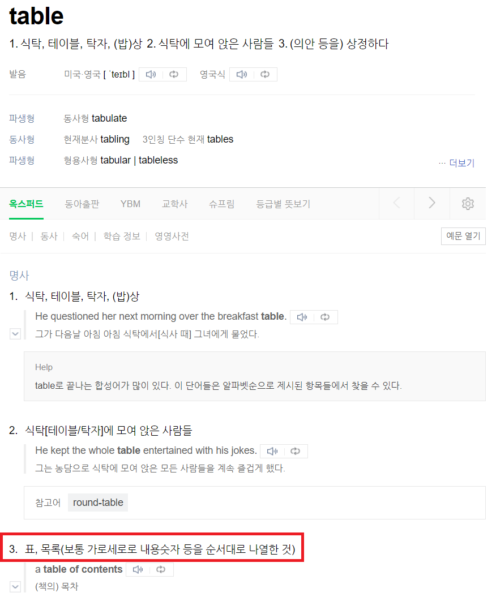
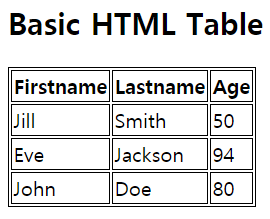
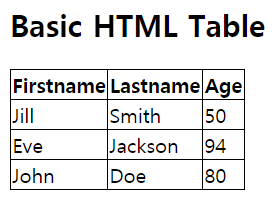
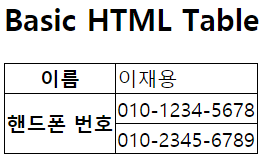
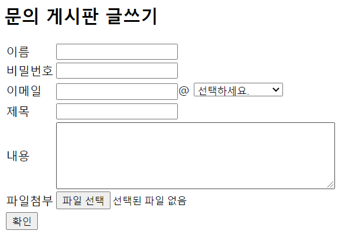

# 2.5일차
### `<table>` 태그
html 강의를 하다가, 가르쳐주지 않은 태그 중에 상당히 중요한 태그가 있는데, 그것은 바로 `<table>` 태그다.
그런데 잠깐, **table**?  
  
표라는 뜻이다! `<table>` 태그를 활용해서 html 문법으로 표를 표현할 수 있다(물론 어제 배웠던 `markdown`으로도 가능하다.).
일단 표현된 모습을 보자.  
  
```
소스코드
<!DOCTYPE html>
<html>
<body>

<h2>Basic HTML Table</h2>

<table>
    <tr>
        <th>Firstname</th>
        <th>Lastname</th> 
        <th>Age</th>
    </tr>
    <tr>
        <td>Jill</td>
        <td>Smith</td>
        <td>50</td>
    </tr>
    <tr>
        <td>Eve</td>
        <td>Jackson</td>
        <td>94</td>
    </tr>
    <tr>
        <td>John</td>
        <td>Doe</td>
        <td>80</td>
    </tr>
</table>

</body>
</html>
```
표의 가로 행을 생성하는 태그는 `<tr>`이고, 표의 제목을 나타내는 태그는 `<th>`이다.
그리고 표의 내용을 나타내는 태그는 `<td>`인데, 각각 `table row`, `table head`, `table data`를 의미한다.
기본적인 속성으로, `<th>`는 굵은 글씨체에 중앙 정렬, `<tr>`과 `<td>`는 보통 글씨체에 왼쪽 정렬이다.

위 예시에서는 `<table>`태그에 `border`속성을 지정해 주지 않았기 때문에 테두리 선이 표시되지 않는다.
HTML5부터는 공식적으로 태그에서 `border`속성을 지원하지 않기 때문에 CSS로 테두리를 나타내 보자.

```
<head>
    <style>
    table, td, tr{
    border: 1px solid black;
}
    </style>
</head>
```
그러면 다음처럼 뭔가 답답해 보이는 표가 나올 것이다. 안답답하다고? 저는 답답해 보이..보입니다..  
  
저것을 이제 선을 하나만 나타내주기 위해서는 `border-collapse` 속성을 사용하면 되는데, 사용법은 다음과 같다.
```
<style>
    table, td, tr{
    border: 1px solid black;
    border-collapse: collapse;
}
    </style>
```

  
깔끔하게 나온 모양이다. 또 테이블간 행 및 열 병합을 해 줄수가 있는데, 이것은 HTML 선에서 처리한다.
문법은 다음과 같다.

```
<table>
    <tr>
        <th>이름</th>
        <th colspan="2">핸드폰 번호</th>
    </tr>
    <tr>
        <td>이재용</td>
        <td>010-1234-5678</td>
        <td>010-2345-6789</td>
    </tr>
</table>

```  
  
마찬가지로 행간 병합도 수행해 줄 수 있는데, 문법은 다음과 같다.

```
<table>
  <tr>
    <th>이름</th>
    <td>이재용</td>
  </tr>
  <tr>
    <th rowspan="2">핸드폰 번호</th>
    <td>010-1234-5678</td>
  </tr>
  <tr>
    <td>010-2345-6789</td>
  </tr>
</table>
```
  
위처럼 위아래로 행이 병합된 모습을 볼 수 있다. 이제 `<table>`의 거의 모든 속성을 다 배웠다! 다음 예제를 풀어보자.

### Example - table
  
위처럼 만들어보자!  
Hint
 + 이름 ~ 이메일 부분까지 `<table>` 하나 작성 후 아랫부분도 `<table>`을 이용하여 작성
 + 사용 태그: `<h3>`, `<table>`, `<tr>`, `<td>`, `<input>`, `<select>`, `<option>`, `<textarea>`
 + 틀 먼저 잡고, 채울 내용 생각