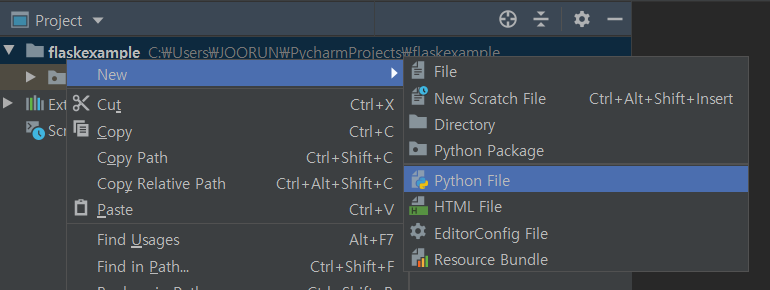

# 3.5일차
자, 2일차까지 우리는 html파일만 만들었다.    
하지만 웹페이지는 인터넷에서 모두 다 같이 볼 수 있어야 한다. 어떻게 할 수 있을까?  

우리가 사용하고, 보는 웹사이트들은 모두 서버가 존재한다.  

  

페이지를 띄워주는 서버가 있고, 사용자(클라이언트)들이 접속 요청을 보내면 허락을 해주는 방식인데,  
그렇다면 서버는 어디에 있을까?   
서버는 개인용 컴퓨터일수도 있고, 아마존 같은 대형 회사에서 빌려주는 웹 서버일 수도 있다.  
이번 시간에는 `Flask`를 사용해서 우리가 만든 서버를 간단하게 호스팅 해보자.  

## Django? Flask?

### Flask!
일단 Flask 라이브러리를 받아야 하기 때문에, 임의의 프로젝트를 하나 생성한 후(이름은 Flaskexample 정도로 해두면 좋을 것이다) 파이참 터미널에 다음과 같이 입력해 보자.
```
pip install flask
```
뭔가가 쭉 깔리고, 얼마 걸리지 않아 설치가 완료된다. 이제 pycharm에서 새로운 python 파일을 하나 생성하자. 다음과..같이 말이다.  
  
파이썬 파일의 이름은 `init.py` 정도로 적당히 정해주도록 하자. 그리고 그 파일을 열어서 다음과 같이 코드를 입력하자.
```
init.py
---------
from flask import Flask

app = Flask(__name__)   # app이라는 이름을 가진 Flask 클래스의 객체 생성

@app.route('/')
def hello_world():
    return 'Hello, World!'

if __name__ == "__main__": 
    app.run()           # 객체의 run함수를 이용하여 로컬 서버에서 앱 실행
```
위와 같이 입력 후, 터미널에서 다음과 같이 입력해 주자.
```
python init.py
```
그러면 뭐시기 뭐시기 뜨면서.. 아래쪽에 주소가 하나 나올 것이다. 그 주소로 들어가면 다음과 같은 창이 나오게 된다.  
  
하지만 지금 상태로는 코드 변경을 바로바로 감지하지 못하므로(Debug 모드가 켜져있지 않으므로), Debug모드를 켜 주도록 하기 위해 `Ctrl+C`를 눌러 서버를 닫은 뒤 터미널에 다음과 같이 입력해보자.  
참고로 Debug 모드는 개발할 땐 편리하지만, 실제 서비스 중일 때는 꺼 두는 편이 낫다.
```
FLASK_DEBUG=1 FLASK_APP=init.py flask run
```
를 입력해 주면 터미널에 나오는 메세지가 조금 바뀌게 된다.
```
...
Debug mode: on  < ----- Debug 모드가 켜진 것을 확인할 수 있음
...
```
이제 F5를 클릭하여 창을 새로고침하는 것 만으로 코드의 변경점을 확인할 수 있다.
다음과 같이 코드를 변경해 보자.

```
from flask import Flask

app = Flask(__name__)

@app.route('/')
def hello_world():
    return '안녕, 세상!'

@app.route('/hello')
def hello_hello():
    return 'HELLO HELLO!'

if __name__ == "__main__":
    app.run(debug=True)
```
위의 코드로 변경한 후 F5를 누르면 기존의 `Hello World!` 메세지에서 `안녕, 세상!`으로 메세지가 바뀐 것을 확인할 수 있을 것이다.
또한 주소창에
```
http://127.0.0.1:5000/hello
```
라고 입력하면 `HELLO HELLO!`라는 메세지를 출력하는 것을 확인할 수 있을 것이다.
하지만 디버그 모드를 사용하더라도 서버를 켤 때마다
```
FLASK_DEBUG=1 FLASK_APP=init.py flask run
```
명령어를 사용하는 것은 상당히 귀찮은 일일 것이다. 그렇기 때문에 코드 마지막 부분을 다음과 같이 수정해 주자.
```
init.py
---------
...
if __name__ == "__main__":
    app.run(debug=True)
```
이렇게 코드를 변경하고, 터미널에 다시
```
python init.py
```

이렇게 python django와 Flask를 사용해서 서버를 로컬에서 호스팅해봤다.  
물론 옆의 친구들이 접속할 수 있도록 하기 위해서는(WWW에 붙여주려면) 추가적인 작업이 필요하지만.. 어쨌든 뭔가 띄워 보았다! 감격스럽지 않은가? ~~아니라고? 어쨌든 감격스럽다~~ 

### Flask로 점심 메뉴 정하기
#### 잠깐! 점심 먹기 전에!
주소창의 문자 및 숫자를 변수로 받아서 장난을 좀 쳐보자.
`<string:name>` 구문을 통해 문자열을 넘길 것이다.
`init.py`에 다음 코드를 추가해보자
```
@app.route("/greeting/<string:name>")
def greeting(name):
  return f'반갑습니다. {name}!'
```

`/greeting/"문자열"`의 주소로 접속하면 페이지에 `반갑습니다. 문자열!`이라고 출력되는 모습을 볼 수 있을 것이다.

문자열을 받아 보았으니, 숫자를 받아 봅시다. 수학에서 `cube`는 세제곱을 뜻한다.
문자열을 받은 것과 동일한 방식으로, `<int:num>` 구문을 통해 숫자를 넘겨받아 넘겨받은 숫자의 세제곱을 계산해 보자.
마찬가지로 `init.py`의 마지막 부분에 다음 코드를 추가하면 된다.
```
@app.route("/cube/<int:num>")
def cube(num):
  result = num ** 3 
  return f'{num}의 세제곱은 {result}'
``` 
`/cube/정수`의 페이지로 접속하면 세제곱이 잘 출력되는 모습을 볼 수 있을 것이다.

#### return 말고 render
점심 먹기 전에 할일이 참 많다. 이때까지는 함수의 return값을 통해 바로바로 출력하는 방식을 취했는데,
그러지 말고 html 파일을 출력하는 방식으로 해 보자.
`init.py`가 있는 경로에 `templates` 폴더를 하나 만들고, 안에 `index.html`파일을 하나 생성하자.
`index.html` 문서의 내부 내용은 다음과 같다.

```
index.html
<!doctype html>
<html>
<head>
    <title>HELLO</title>
</head>
<body>
    HELLO FLASK!
</body>
</html>
```
그리고 `init.py`의 내용을 다음과 같이 바꿔주자.
```
init.py
from flask import Flask, render_template
app = Flask(__name__)
 
@app.route('/')
def hello():
    return render_template('main.html')
    
if __name__ == '__main__':
    app.run(debug=1)
```
이제 Flask를 이용해서 `html` 파일을 출력할 수 있게 되었다!

#### 이제 진짜 점심 메뉴 고르기
사실 거창하게 점심 메뉴를 고른다고 했지만, 우리에게 선택지는 짜장면과 짬뽕밖에 없다.
`static` 폴더를 만들고, 구글에서 사진을 골라서 집어넣은 다음, 코드를 다음과 같이 변경하자.
```
init.py
from flask import Flask, render_template
from random import sample

app = Flask(__name__)

@app.route('/')
def main():
    return 'hello world'

# 사람 수 만큼 점심 메뉴 추천
@app.route("/lunch/<int:people>")
def lunch(people):
  menu = ["짜장면", "짬뽕", "라면", "브리또", "사과", "찜닭"]
  return f'{sample(menu, people)}'


@app.route("/show")
def show():
  # 음식 사진을 static 폴더에 추가하고 menu에 집어 넣습니다
  # 음식 메뉴 개수는 더 많아도 됩니다
  menu = ['짜장면.jpg', '짬뽕.jpg']
  # 음식 메뉴 1개를 뽑습니다
  pickme = ''.join(sample(menu,1))
  # index.html 파일에 이미지를 불러옵니다
  return render_template('index.html', food_img=pickme)


if __name__ == '__main__':
    app.run(debug=1)
```
```
index.html
<!doctype html>
<html>
<head>
    <title>show</title>
</head>
<body>
    
</body>
</html>
```