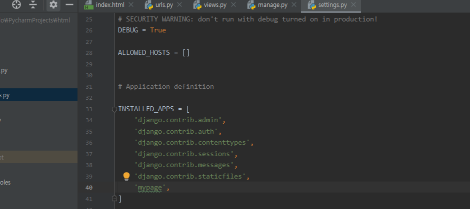

# 3.5일차
자, 2일차까지 우리는 html파일만 만들었다.    
하지만 웹페이지는 인터넷에서 모두 다 같이 볼 수 있어야 한다. 어떻게 할 수 있을까?  

우리가 사용하고, 보는 웹사이트들은 모두 서버가 존재한다.  

  

페이지를 띄워주는 서버가 있고, 사용자(클라이언트)들이 접속 요청을 보내면 허락을 해주는 방식인데,  
그렇다면 서버는 어디에 있을까?   
서버는 개인용 컴퓨터일수도 있고, 아마존 같은 대형 회사에서 빌려주는 웹 서버일 수도 있다.  
이번 시간에는 `Python Django`와 `Flask`를 사용해서 우리가 만든 서버를 간단하게 호스팅 해보자.  

## Django? Flask?

`Django`를 사용한다고 했는데 과연 `Django`가 뭘까?  
Django는 파이썬으로 제작된 웹 프레임워크이다.  
모르는 단어가 계속 나온다. 프레임워크란? 틀이라고 생각하면 편하다.  

  

위 사진을 보면 자동차의 프레임이 있다. 여기에 다른 부품들을 장착하면 자동차가 되듯이,  
Django라는 프레임에 우리가 여러가지 부품들을 붙이기만 하면 손쉽게 웹사이트를 구성할 수 있도록 도와주는 라이브러리이다.  
그렇다면 Flask는?
Flask도 마찬가지로 프레임워크지만, django는 `풀 스택 프레임워크`인데 반해 Flask는 `마이크로 프레임워크`라는 것이다.
`마이크로`라니, 뭔가 일단 가벼울 것 같지 않은가? 실습을 통해 조금 더 자세히 알아보기로 하자.
  
#### CASE django
일단 django 라이브러리를 다운받아 보자. 파이참 터미널에 아래와 같이 명령어를 입력한다.   
```shell script
$ pip install django
```  
설치가 완료되면 프로젝트를 시작해야 한다. `mysite`라는 프로젝트를 새로 하나 만들어 주자.  
```shell script
$ django-admin startproject mysite
```  
프로젝트를 만들었다면, 프로젝트 폴더로 들어가서 우리가 실행할 앱을 하나 만들어야 한다.  
```shell script
$ cd mysite
$ python manage.py startapp mypage
```  
앱을 만들었다면 등록해주어야 한다.  
`mysite/settings.py`의 약 40번째 줄에 아래와 같이 추가해준다.  

  

여기까지 했다면 기초공사가 완료된 것이다!  
이제 `mysite/mypage/templates/mypage`폴더를 하나 만들어,  
그 안에 우리가 지난 시간에 실습으로 작성한 `index.html`파일을 넣어주자.  

  

이제 우리가 만들 `html`파일을 인코딩해서 웹에 띄우는 작업을 해야한다.  
`mypage/views.py`파일을 열어 다음 코드를 추가해준다.  

```python
from django.shortcuts import render

# Create your views here.
def index(request):
    return render(request,'mypage/index.html')
```  
이제 마지막으로 우리의 `view`와 `url`을 연결만 해주면 된다.  
`mypage/urls.py`파일을 하나 새로 만들어 아래의 코드를 추가해준다.  
```python
from django.urls import path

from . import views


urlpatterns = [
    path('', views.index, name='index'),
]
```  
이 앱의 `url`과 프로젝트의 `url`을 연결해주자
`mysite/urls.py`에 들어가서 아래와 같이 바꿔준다.  

```python
from django.contrib import admin
from django.urls import path, include

urlpatterns = [
    path('admin/', admin.site.urls),
    path('', include('mypage.urls')),
]
```  
그러면 끝이 났다. 터미널에 아래 명령어를 입력해 우리가 만든 페이지를 호스팅해보자.  

```shell script
$ python manage.py runserver
```

  
위에 적힌 주소를 인터넷에 치면 우리가 만든 페이지가 나타날 것이다!

