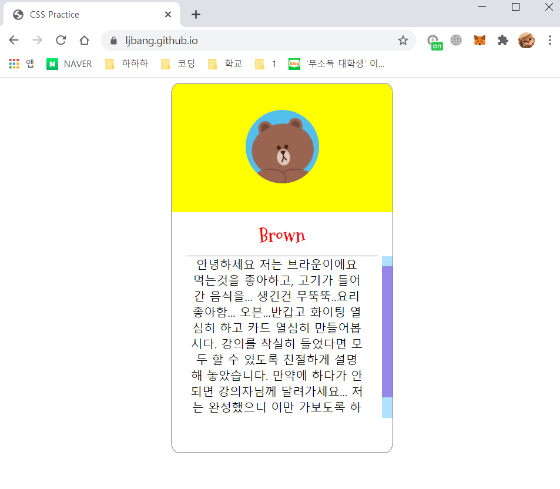

# 3일차

## github pages
자, 2일차까지 우리는 로컬환경, 즉 우리만 볼 수 있는 페이지를 만들었다.  
하지만 웹페이지는 인터넷에서 같이 볼 수 있어야한다. 어떻게 할 수 있을까?  
  
우리가 사용하고, 보는 웹사이트들은 모두 서버가 존재한다.  

  

페이지를 띄워주는 서버가 있고, 사용자(클라이언트)들이 접속 요청을 보내면 허락을 해주는 방식인데,  
그렇다면 서버는 어디에 있을까?   
서버는 개인용 컴퓨터일수도 있고, 아마존 같은 대형 회사에서 빌려주는 웹 서버일 수도 있다.  
그런데, 우리가 작은 프로젝트를 하는데 컴퓨터 한대를 계속 켜놓거나, 돈을 내고 웹 서버를 빌릴 수는 없다.(ㅠㅠ)  
그런 우리를 위해서 github에서 서버를 무료로 빌려줍니다!  
물론 공짜로 빌려주는 것이라 데이터를 저장한다거나 할수는 없지만 연습용이나 간단한 포트폴리오를 만들어서 저장할 수 있다.  
지금부터 한번 서버를 띄워보자!  

먼저 `github`에 접속해서 새 레포지토리를 만든다.  
여기서 주의할 점은 레포지토리의 이름을 `username.github.io`의 형태로 만들어야 한다.  

  

레포지토리를 만들었다면 이제 이전시간에 만든 `HTML`파일과 `CSS`파일을 넣어보자!  
여기서 주의할 점은 `HTML`파일의 이름은 `index.html`로 통일해주어야 `github`에서 인식해서 `html`을 적용해준다.  
파일을 넣었다면 이제 완성입니다! 주소창에 `username.github.io`를 타이핑해주면  
우리가 만든 페이지가 나타나는걸 확인할 수 있다.  

## bootstrap

이전시간까지 우리가 직접 웹페이지를 만들어서 github pages를 이용해 웹상에서 호스팅 해봤다.  
하지만 솔직히 말해서! 우리가 만든 웹페이지들은 전문가들이 만든 페이지들에 비해서 부족할 수 밖에 없다.  
이번시간에는 `bootstrap`을 통해 전문가들이 만들어놓은 페이지 템플릿을 사용해서 더 완성도 있는 페이지를 만들어 보도록 하자.  