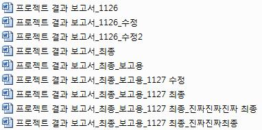
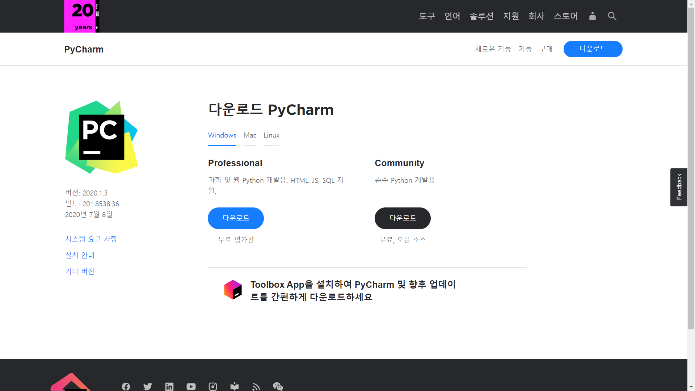
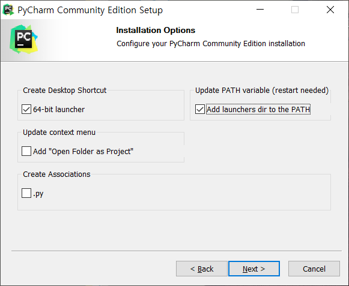
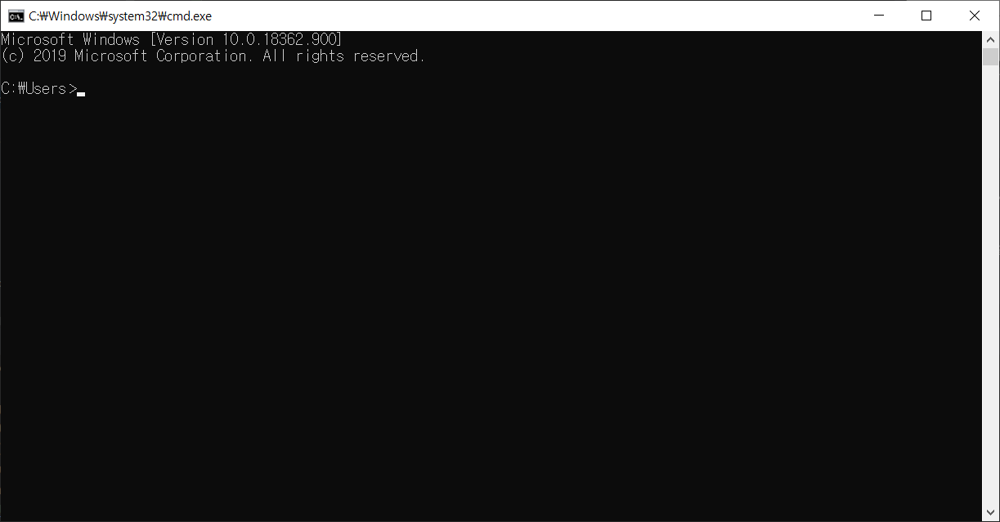

# 전체 수업에 들어가기 전에 알아야 할
### Github 그리고 파이참
  
GitHub 마스코트 octocat. 고양이와 문어를 합쳐놨다. 상당히 유명한 무료 Git 저장소로,
현재 해달프로그래밍에서 프로젝트를 진행할 때는 이 Guthub을 꼭 사용한다고 봐도 무방하다.
이제 간단한 git 명령어와 github 사용법을 알아보도록 하자.


##### [Github](https://github.com)  
`깃헙` 또는 `깃허브` 라고 읽는, 위 사이트에 들어가서 가장 먼저 무엇을 해야할 지 생각해보자. 모르겠다고?  
　  
　    
　   
　      


...
일단 Sign up(회원가입ㅎ) 부터 하도록 하자.
username은 깃헙에서 앞으로 계속 쓰게 될 이름이고,
추후 만들 `Github Pages`의 주소와 직결되는 부분이기 때문에 간단하고도 예쁘게 지어주도록 하자.
~~그걸 어떻게 하는 거냐고? 멍청한 놈!~~

일단 가입을 완료했다면, VCS에 대해 알아보자.
#### VCS?
> 버전 관리 시스템, Version Control System

**버전 관리, 소스 관리, 소스코드 관리**라 함은 동일한 정보에 대해 여러 버전을 관리하는 것을 말한다. 다음과 같은 경험이 있는가? ~~없다고? 멍청한 놈!~~  
  
위 사진이 바로 **같은 정보**에 대한 **여러 버전**의 대표적인 예라고 할 수 있다. 팀 단위로 개발할 때 소스코드의 관리를 위해 주로 사용한다.

#### 버전 관리를 해야 하는 이유
+ 잘 못 되었을 때(삭제 등) 복구하기 위해서
+ 변경 사항을 추적하기 위해서

등이 있다고 할 수 있다. Git은 대표적인 VCS라고 할 수 있다.

#### Github의 사용
Github의 repository 생성, 다른 사용자의 repository fork 등 Github의 사용법과,
터미널에서 사용 가능한 Git 명령어에 대해 알아보자.
#### Repository
##### Repository의 종류
`GIT Repository`는 말 그대로 파일이나 폴더의 저장소를 의미한다!
GIT은 두 종류의 저장소를 제공하는데,
* 원격 저장소(Remote Repository) : 파일이 원격 저장소 전용 서버에서 관리되며 여러 사람이 함께 공유하기 위한 저장소  

* 로컬 저장소(Local Repository) : PC에 파일이 저장되는 개인 전용 저장소

##### Repository 생성
* __기존 디렉토리를 Git 저장소로 이용__  
기존의 로컬 디렉토리를 Git 저장소로 이용하고 싶은 경우 해당 디렉토리에서 다음과 같은 명령어를 실행하면 된다.
```
git init
```
이 명령어는 .git 이라는 하위 디렉토리를 만들며 내부에 저장소에 필요한 기본 파일들을 담고 있다.

* __기존 저장소를 Clone__  
`Clone`이란 누군가가 만들어 놓은 저장소의 내용을 웹으로부터 모두 다운로드하는 것을 의미한다. 이 작업을 통해 복제한 저장소를 로컬 저장소로 사용할 수 있게 된다.
쉽게 말해 남의 것 빌려~~훔쳐~~ 오는 것이라고 생각하면 된다.
```
git clone [url]
```

#### 작업의 흐름
 Git은 파일을 `Committed`, `Modified`, `Staged` 이렇게 세 가지 상태로 관리한다.
 Committed란 데이터가 로컬 저장소에 안전하게 저장되었다는 것을 의미하고,
 Modified는 수정한 파일을 아직 로컬 저장소에 commit하지 않은 것을 말한다.
 Staged란 현재 수정한 파일을 곧 commit할 것이라고 표시한 상태를 의미한다.   
 
이 세 가지 상태는 Git 프로젝트의 세 구성 단계인 `Git 디렉토리`, `워킹 디렉토리`, `Staging Area(Index)`와 관련이 있다!
아래 그림을 보자.


 * Git 디렉토리는 Git이 프로젝트의 데이터를 저장하는 곳이다.
 * 워킹 디렉토리는 프로젝트의 특정 버전을 가져온 것이다.
 * Staging Area는 Git 디렉토리에 있으며, 단순한 파일이고 곧 커밋할 파일에 대한 정보를 저장한다. Index라고도 한다.
 
대략적인 흐름은 다음과 같다.
1. 워킹디렉토리에서 파일 수정
2. Staging area에 파일을 `stage`해서 commit할 스냅샷 생성
3. Staging area의 파일들을 `commit`해서 Git 디렉토리에 영구적 스냅샷으로 저장
4. `Push`를 통해 원격 저장소에 전송

##### Add
파일이나 폴더의 변경사항을 저장소에 기록하려면 `commit`을 해 주어야 한다. 하지만 막무가내로 commit 명령어를 입력한다고 해서 모든 변경사항들이 스냅샷으로 저장되지는 않는다.
우선 `add` 명령어를 이용해 변경한 파일들을 스냅샷에 추가할 것이라고 알려주어야 한다. 달리 말해 파일들을 Staging area로 stage하는 것을 의미한다.
```
git add .
```
위의 명령어를 통해 모든 하위디렉토리의 파일을 stage할 수 있다.
`add .`에서  .대신 파일이름을 기입함으로 특정 파일만을 stage할 수도 있다.
##### Commit
파일이나 폴더의 변경사항을 저장소에 기록하려면 `commit`을 해 주어야 한다.   
Staging area의 파일들을 Git 디렉토리에 영구적 스냅샷으로 저장하는 것이다.
```
git commit -m "간단한 설명"
```


##### Push
`Push`란 GIT에서 웹 상의 원격 저장소로 변경된 파일을 업로드하는 것을 의미한다. 
앞서 commit을 통해 로컬저장소에 저장한 변경사항들을 원격 저장소에 업로드하는 것이다.
내 PC의 로컬 저장소에서 변경된 이력을 원격 저장소에 공유하려면,
반드시 Push를 통해 로컬 저장소의 변경 이력을 원격 저장소에 업로드해야 한다.
```
git push origin master
```
위 명령어를 통해 master branch로 데이터를 전송할 수 있다.

##### Pull
`Pull`은 프로젝트 내용을 원격 저장소에서 로컬 저장소로 업데이트하는 작업을 의미한다.
pull 을 실행하면, 원격 저장소에서 최신 변경 이력을 다운로드하여 내 로컬 저장소에 그 내용을 적용한다.  
여러명이 하나의 원격 저장소를 이용해 공동작업을 수행하는 경우 각 인원이 같은 원격 저장소에 Push를 할 것이다.
그럼 이로 인해 발생하는 변경내용을 나의 로컬저장소에도 적용할 필요가 있다.
이 때 Pull 명령어를 이용해 최신사항을 업데이트한다.
```
git pull
```

__참고문헌__
* [ihoneymon의 마크다운 작성법](https://gist.github.com/ihoneymon/652be052a0727ad59601)
* [누구나 쉽게 이해할 수 있는 Git 입문](https://backlog.com/git-tutorial/kr/)

* [https://git-scm.com/](https://git-scm.com/)
* [git 간편안내서](https://rogerdudler.github.io/git-guide/index.ko.html)
## PYCHARM
  
파이참 로고.

### 파이참 설치
[다운로드는 여기](https://www.jetbrains.com/ko-kr/pycharm/)

먼저 위의 Jetbrains 페이지에 접속하게 되면

  
위와 같은 화면이 나오게 되는데, 여기서 화면 중간에 있는 다운로드 클릭

  
우리는 프로페셔널하지 않기 때문에 Community 아래 검은 동그라미 다운로드 클릭

  
누르고 기다리면 다운로드가 시작된다.


PATH만 추가해주면 된다.

### 파이참 세팅
#### Git Bash와 commandr
##### Git Bash

##### Windows command


윈도우는 cmd를 사용하는데, git bash로 리눅스체제의 명령어를 윈도우에서도 사용할 수 있다.
따라서 mac이나 리눅스를 사용하는 사람은 따로 설치하지 않고 기존의 터미널을 사용해도 된다.

[다운로드는 여기](https://git-scm.com/) 에서!

중간에 다운로드 누르고 계속 진행진행 하면 된다. 모두 설치가 완료되었다면, 파이참을 열고 File-Settings-Tools-Terminal-Shell Path에 들어가주자.
거기에서 아래 사진과 같이 경로를 설정해주고, 파이참 화면에서 Terminal을 눌러주면 아래쪽의 터미널이 command에서 Git bash로 바뀌게 된다.

  

처음 파이참을 설치하고 터미널을 바꿔 줬으면, 본인의 깃헙 계정과 연동해야 한다. 계정이 없다면, 계정 생성부터 하고, 계정이 있다면, 파이참 터미널에서 다음과 같이 치면 된다.  
```
git config --global user.name 계정명
git config --global user.email 이메일명
```
이렇게 두개를 쳐 줘야 본인의 깃헙 계정과 연동이 되고, 자유롭게 레포를 클론해 와서 자신의 문서를 관리할 수 있다.