# Jekyll을 활용한 Blogging
##### 잠깐! 그 전에!
### `markdown` 문법
  
이때까지 배웠던 `.html` 말고 웬 이상한 `.md` 파일을 작성해야 한다! 한번 대충 봤지만, 다시 한번 더 보기로 하자.
못 느꼈다고? 거짓말하지 마라. 다 알고 있다... 뭔가 이상했다고 해줘..

아무튼 `markdown`이란.. 현재 이 문서도 `markdown`으로 작성하고 있는데, `html`과 마찬가지로 페이지를 나타내주는 마크업 문서이다.
~~마크down은 마크up 깔깔쓰~~ `html`은 태그도 많고, 구조도 직관적으로 알기 힘들지만, `markdown`은 읽기도 쓰기도 쉽고, 숙달되면 키보드만 가지고 모든 것을 할 수 있기 때문에 편리하다.

#### 마크다운의 장점
+ 배우기가 쉽고 직관적이다.
+ `html`로의 변환이 가능하다(Jekyll도 이런 식이다. markdown으로 작성 후 html로 변환하는..)
+ 텍스트로 작성 및 관리하기 때문에 git을 통한 버전관리가 가능하고, 가볍다.
+ `jupyter notebook` 등 다른 기술에서도 활용이 용이하다.

#### 마크다운의 단점
+ 중심이 없기 때문에 핵심 문법을 제외하고는 편집기에 따라 다른 결과물을 출력할 수도 있다.

마크다운은 유명한 만큼 여러 갈래(parser)를 가지고 있고, 파서에 따라 조금씩 기능도 다르다.
[이 문서](https://github.com/markdown/markdown.github.com/wiki/Implementations)에서 마크다운 파서의 종류와 기능을 확인해보도록 하자.

뭐 처음엔 한글 쓰는 것 보다 어려울 순 있어도, 익숙해지고 나면 꽤 편하다. 실제로 주는 효과도 몇 없고.. 이미지와 볼드 처리 정도만 할 줄 알면 꽤나 훌륭한 문서를 적을 수 있게 될 것이다.
이제 주로 사용하는 문법들을 가지고 실습해보자.

### Markdown 실습
<details markdown="1">
<summary>접기/펼치기</summary>
#### 글머리(Headers)
문서를 만들 땐, 제목이 필요하겠죠? 제목 앞에는 #을 붙이면 된다. #의 개수를 늘려갈수록 하위 번호가 된다. 또한, #은 6개까지 사용가능하다.
```
# 이렇게 말이죠
## 샵 두개는 이렇게
### 샵 세개는 이렇게
```
# 이렇게 말이죠
## 샵 두개는 이렇게
### 샵 세개는 이렇게
#은 6개까지 사용가능하다.

#### 인용구(BlockQuote)
꺾쇠를 사용하면 된다.(>)
```
>안녕 나는 인용구야
>줄을 바꾸려면 줄 마지막에 스페이스바를 두번 치고 엔터를 치고 다시 꺾쇠를 넣어주면 돼.
>근데 꺾쇠가 맞냐 꺽쇠가 맞냐?
>>꺾쇠가 맞아 바보야.

```
>안녕 나는 인용구야  
>줄을 바꾸려면 줄 마지막에 스페이스바를 두번 치고 엔터를 치고 다시 꺾쇠를 넣어주면 돼.  
>근데 꺾쇠가 맞냐 꺽쇠가 맞냐?
>>꺾쇠가 맞아 바보야.

#### 목록

##### 순서가 있는 목록
숫자와 점을 사용해 표현한다.
```
1. 일번
2. 이번
6. 육번 같지만 삼번이라구~
5. 오번 같지만 사번이라구~
5. 오번
```
1. 일번
2. 이번
6. 육번 같지만 삼번이라구~
5. 오번 같지만 사번이라구~
5. 오번

##### 순서가 없는 목록
*, -, +와 Tab을 사용해 나타낸다. (섞어서 사용하는 것도 가능한데, 이 편이 가독성이 더 좋다)
```
* 데헷
+ 데헷
- 데헷
* 쿵쾅쿵쾅
    - 쪼륵쪼륵
        + 다시 더하기로
```

* 데헷
+ 데헷
- 데헷
* 쿵쾅쿵쾅
    - 쪼륵쪼륵
        + 다시 더하기로
   
#### 강조
취소선, 기울임(이탤릭), 굵게(볼드) 등이 있다. 마찬가지로 섞어서 사용이 가능하다.
```
*별 하나*
_밑줄 하나_
**별 둘**
__밑줄 둘__
***별 셋***
___밑줄 셋___
_기울여서 쓰다가 **볼드로 쓰다가** 다시 기울여서 쓰기_
~~물결표 둘~~
`박스쳐서 강조`
```
*별 하나*  
_밑줄 하나_  
**별 둘**  
__밑줄 둘__  
***별 셋***  
___밑줄 셋___  
_기울여서 쓰다가 **볼드로 쓰다가** 다시 기울여서 쓰기_  
~~물결표 둘~~  
`박스쳐서 강조`

#### 링크 삽입
```
[링크 이름](링크 주소)
[구글!](https://www.google.com)
```
[구글!](https://www.google.com)

#### 이미지 삽입
```


```
  
이.. 마크다운에 약간 아쉬운 것이,
마크다운 문법으로는 이미지 조절아 안 된다(여러 바리에이션이 있어서 되는 것들도 있긴 하지만, 깃헙 페이지(블로그가 아님)에서는 잘 안 되더라..).
만약에 난 죽어도 이미지 크기 조절을 해야겠다! 싶으면, 원본 이미지 파일 크기 조절을 하거나, `html` 문법을 사용하면 된다.
```

```

#### 가로줄 삽입
그냥 구역을 나누고 싶을 때 사용하면 된다.
```
구역1구역1구역1구역1구역1구역1구역1구역1
* * * / - - - / ****************** // 세가지 모두 가능
구역2구역2구역2구역2구역2구역2구역2구역2구역2구역2구역2구역2구역2구역2구역2구역2
```
구역1구역1구역1구역1구역1구역1구역1구역1
- - -
구역2구역2구역2구역2구역2구역2구역2구역2구역2구역2구역2구역2구역2구역2구역2구역2

### markdown 편집기
그냥 내맘대로 줄줄줄줄 적어도 되지만(현재 파이참에서 그냥 줄줄줄 작성중이지만.. 그래도 꽤 볼만하잖아?), markdown도 편집기가 있다.
마치 한글로 된 문서를 편집할 때 Microsoft Word나 한글과컴퓨터의 한글을 이용하듯이 말이지. 대표적인 것 세 가지를 소개하겠다.

+ Prose.io
+ StackEdit
+ [typora](https://typora.io/) : 가장 유명한 `markdown` 편집기. 가볍고, 예쁘다. Github-Flavored-Markdown(GFM)을 사용한다.

### 대망의 markdown 연습
아무 markdown 입력기(pycharm, typora 등)나 이용해 마크다운 문서를 작성하여 다음처럼 출력하시오~   

</details>

### 그래서 Jekyll이 뭔데?
`Jekyll`은 우리가 이때까지 이용한 `github`에서 개발한 툴이다. 또다른 개발 툴인 `Wordpress`와의 가장 큰 차이점이라고 한다면, `Jekyll`은 `정적 웹사이트(Static website)`라는 것이다.
HTML 또는 Markdown으로 글을 작성하면 미리 정의해 놓은 규칙에 따라  페이지를 내놓게 된다. 이 때 사용자는 내부 파일인 `_config.yml` 파일이나 `_posts` 폴더의 수정을 통해 원하는 기능을 구현할 수 있다.

아까 `Jekyll`이 `정적 웹사이트`라고 했는데, 당신은 `정적 웹사이트`에 대해 들어본 적이 있는가? 있다고? 거짓말 치지 마라. `정적 웹사이트`가 뭔지 모르는 당신을 위해 설명해 주겠다.  
~~안녕! 내 이름은 스피드왜건! 정적 웹사이트를 설명해 주기 위해 런던빈민가에서부터 널 따라왔지!~~

  
그림을 보면, 사용자는 web을 통해 서버에 페이지를 요청하고, 페이지를 요청받은 서버는 html 파일을 그대로 전달한다. 이것이 `정적 웹 페이지`라는 것이다. 그렇다면 `동적 웹 페이지`라는 것도 있을까?

물론 있다.  
  
위 그림에서는 사용자가 web을 통해 서버에 페이지를 요청했을 때, 서버 내부에서 데이터들을 스크립트에 의해 가공처리 한 후 html 파일을 전달하게 된다.

이러한 구조적 차이로 인해 `정적 웹 페이지`와 `동적 웹 페이지`의 장단점이 발생하는데,

#### `정적 웹 페이지`
- 장점
    + 로딩 속도가 빠르다(따로 뭔가 처리할 필요 없이 요청한 페이지만 보여주면 됨).
    + 유지비가 적게 든다(웹 서버만 구축하면 됨).
    
- 단점
    + 비전문가가 사용하기 어렵다.
    + 서비스가 한정적이다(이미 저장된 정보만 보여줄 수 있음).
    
#### `동적 웹 페이지`
- 장점
    + 서버 안에 저장된 데이터들을 통해 여러 서비스를 할 수 있다.
    + 비전문가가 사용하기 편리하다(네이버, 다음 블로그 등).
    + 유지보수에 용이하다.

- 단점
    + 느리다(사용자가 요청하면 서버에서 데이터를 가공해야 함).
    + 비싸다(추가적으로 애플리케이션 서버를 두어야 함).

돌고 돌아 다시 `Jekyll`로 돌아가보자. 시작부터 약간의 문제가 발생하는데, 우리는 이때까지 파이썬을 사용해서 무언가 작업을 했다.
하지만 지금 시작할 때 잠깐 필요한 언어가 있는데, 그것은 바로 `Ruby`이다.
하나 다행스러운 것은 `Ruby`를 설치만 하면 우리가 설정해놓은 `git bash`에서 자동으로 루비 명령어를 사용할 수 있다는 점이다.
일단 `Ruby` 설치부터 진행해 보자

#### Ruby 설치하기
[Ruby Installer 공식 페이지](https://rubyinstaller.org/)  
일단 위의 페이지로 들어가서 빨갛고 커다란 Download를 누르면 다음과 같은 창이 뜰 것이다.  
  
우리가 사용할 버전은 2.6.6-1이고, 대단히 친절하게도 두꺼운 글씨로 되어 있다.
혹여 그럴 사람은 없겠지만 32비트 윈도우를 사용 중이라면 바로 아래에 있는 x86을 받아서 설치하면 된다. 설치파일을 다운로드 받은 후 실행시켜 보자.

  
  
설치 중 위의 사진처럼 체크해주고 설치를 진행하면 된다. 두 번째 사진의 경우 딱히 쓸 일은 없지만, 혹시를 위해 설치해둔다고 생각하면 편하다. 설치에 시간이 좀 소요되는데, 물이라도 한 잔 마시면서 기다리도록 하자.

모두 설치가 되었다면, 다음과 같은 창이 뜰 것이다.  
  
여기서 Finish를 눌러주면

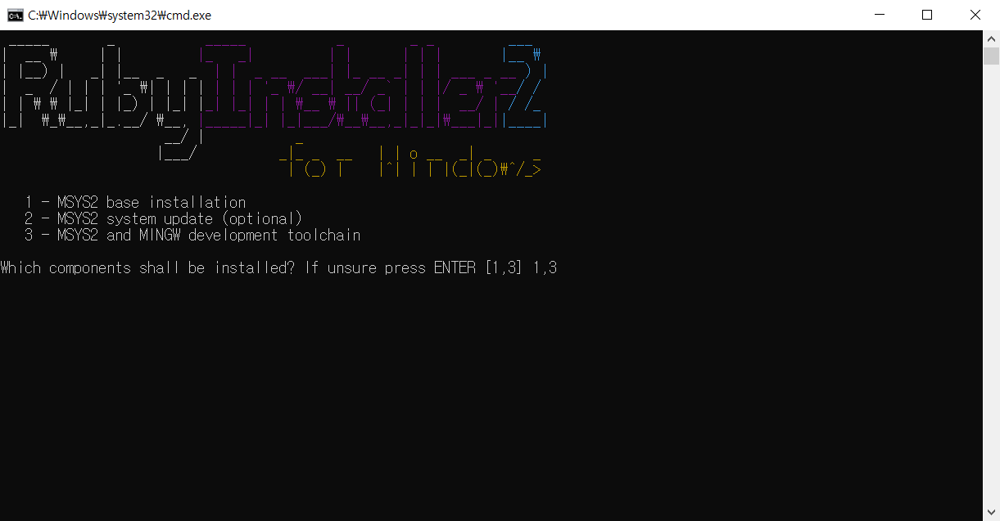  
위와 같은 창이 뜨는데, unsure하기 때문에 1,3 을 치고 Enter를 눌러주면 파일이 설치가 되고,
다 됐을 때 엔터를 한 번 더 누르면 터미널 창이 꺼지게 된다. 그리고 파이참을 재시작 후, 터미널 창에서
```
ruby -v
```
를 치면 현재 설치된 `ruby`의 버전이 나오게 된다. 현재 설치된 버전을 확인해보면
```
ruby -v
ruby 2.6.6p146 (2020-03-31 revision 67876) [x64-mingw32]
```
라고 나올 것이다. 위처럼 나오지 않았다면 뭔가 잘못 설치했을 확률이 높기 때문에 다시 찬찬히 확인해 보도록 하자.

일단 `jekyll` 및 기타 라이브러리들을 사용하기 위해 몇 가지를 Terminal 창에서 install 해주자.
```
gem install jekyll
gem install jekyll-feed
gem install bundle
gem install github-pages
gem install tzinfo-data
``` 
처음부터 블로그를 만들기는 대단히 어려운 작업이기 때문에, 다음 사이트들을 참고하여 마음에 드는 테마를 구하자.
하지만 이번 수업에서는 편의를 위해 완성되어 있는 블로그를 사용할 것이다.  

[https://github.com/topics/jekyll-theme](https://github.com/topics/jekyll-theme)  
[http://jekyllthemes.org/](http://jekyllthemes.org/)  
[https://jekyllthemes.io/free](https://jekyllthemes.io/free)  
[http://themes.jekyllrc.org/](http://themes.jekyllrc.org/)  
Minima, Clean Blog 등 유명한 테마들이 포함되어 있다. Jekyll은 구글에 자료가 많은 편이므로, 구글링을 통해 각 테마를 사용하는 법을 익히도록 하자.

#### 완성된 블로그 베끼기(!)
우리가 참고할 [블로그 주소](https://theorydb.github.io/)이고,  
[블로그 깃헙 주소](https://github.com/theorydb/theorydb.github.io)를 눌러보자.

  
fork를 누르고, 나의 repository를 선택해주면 나의 repository에 fork된다. 그 후, fork한 나의 repository에 들어가서 톱니바퀴 모양을 눌러 설정 창으로 들어가자. 다음과 같은 창이 나올 것이다.  
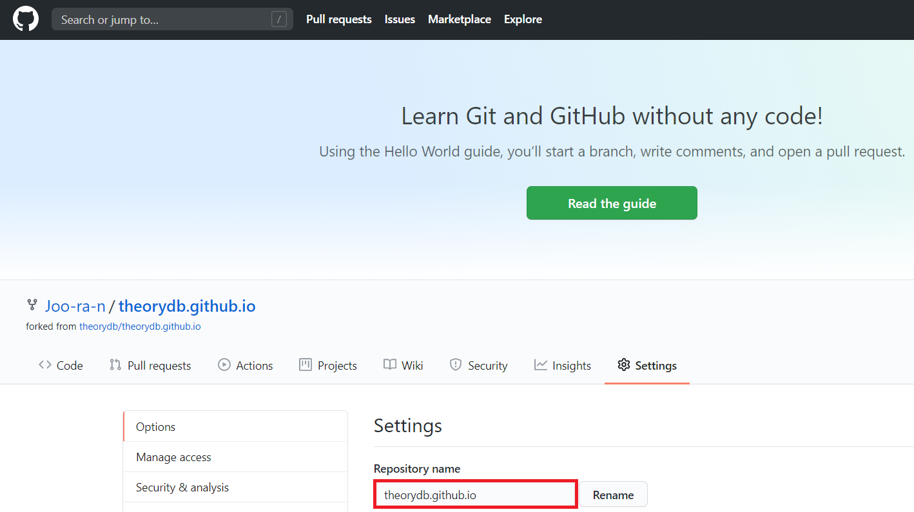  
빨간색 네모 친 부분(repository name)을 `username.github.io`로 바꿔주자. 본인의 username은 Joo-ra-n 이기 때문에
```
Joo-ran.github.io
```
로 설정해주었다. 그 후 오른쪽의 `Rename` 버튼을 클릭해주면 repository name이 성공적으로 변경할 수 있다. 아래쪽의 Issue 부분에만 체크해 주고, 주소창에
```
https://username.github.io
```
를 입력하면...  
  
404 에러가 뜬다! Github Pages에 리얼타임으로는 반영이 되지 않으므로 잠시 기다려 주도록 하자. 잠시 기다린 후 다시 주소를 쳐보면..

  
원래의 블로그를 잘 베껴온 모습이다. 이로써 내용물은 남의 것이지만, 어쨌든 내 username으로 된 블로그가 하나 생겼다. 이제 이 블로그를 내 입맛에 맞게 조금씩 바꾸어나가는 작업을 하게 될 것이다.. 

이제 이 베껴온 블로그를 로컬에서 편집하기 위해 Pycharm을 켜고, terminal에 다음과 같이 입력해주자.
```
git clone https://github.com/"username".github.io // 본인 repository를 로컬로 clone
...
cd "username".github.io                           // "username".github.io로 경로 변경
bundle install                                    // ???
bundle exec jekyll serve                          // jekyll 블로그 로컬서버 오픈
```
이렇게 하면 localhost 주소인 `127.0.0.1:4000`으로 아까 github pages에서 보았던 것과 같은 페이지가 열리게 된다.
앞으로 우리는 pycharm에서 파일들을 수정한 뒤, 로컬 서버에서 확인해 보고 문제가 없으면 github에 push하는 식으로 블로깅을 진행할 것이다.

ctrl+c를 눌러 일단 서버를 닫고, 무엇을 수정해야 하는 지 알아보자.

##### 1. 변경해야 하는 것
+ _featured_tags/ : 블로그 포스팅 게시판 대분류
+ _featured_categories/ : 블로그 포스팅 게시판 소분류
+ _data/ : 개발자 및 기타 정보 폴더(author.yml 파일 또한 수정 필요)
+ _config.yml : 블로그의 환경변수를 설정하는 파일. 기본적인 블로그 세팅 담당
+ README.md : github 소스 페이지에 뜨는 문서이자, About 메뉴 클릭 시 나타나는 블로그 소개글

##### 2. 변경하면 좋은 것
+ assets/ : 이미지, CSS 등을 저장한 폴더(여기에서 검색 이미지도 바꿀 수 있음)
+ _layouts/ : 포스트 외부의 틀을 정하는 폴더(페이지, 구성요소 등 UXUI 변경 시 수정 필요)
+ _includes/ : 기본 페이지 폴더(여기에선 footer를 바꿀 수 있다)
+ Gemfile.lock : Gemfile에 기록한 라이브러리를 설치 후 기록하는 파일(중복 설치 방지)
+ .gitignore : github에 올리고 싶지 않은 파일들을 적어 놓은 리스트
+ sitemap.xml : 테마의 사이트맵
+ robots.xml : 검색엔진 수집 등에 대한 정책을 명시하는 설정 파일
+ posts.md : 포스트 작성 관련 설정 파일

##### 3. 뭐가 있는지 확인만 하자
+ _posts. : 실제 글을 쓰는 폴더
+ index.html : 블로그의 메인 페이지(최초 접속 시 뜨는 페이지)
+ 404.md : 404 Not Found Error가 떴을 때 페이지

[지킬 한글화 공식 페이지](http://jekyllrb-ko.github.io/docs/structure/)를 참고해서 뭐가 있는지 보면 된다.

일단 `_featured_categories/`, `_featured_tags` 파일들을 수정해서 전체적인 블로그의 틀을 잡는 것이 좋다.
내가 블로그를 어떤 식으로 운영할 지 생각해 보고 기존의 게시판들을 갈아엎은 후에 나의 입맛에 맞게 게시판 구조를 바꾸자.
그 후 `_posts` 폴더의 포스트들을 한 개(참고용)을 제외하고 전부 삭제한 후, 일단 나만의 게시물을 하나 쓰면 된다.
다음은 본인이 시험삼아 한 번 작성해 본 것이다. 원래 있던 글 제목 양식에 맞추어 마크다운 문서 제목을 정해주면 된다.
```
2020-07-20-etcetera-myfirstpost.markdown

---  
layout: post  
title: "[기타] 나의 첫 번째 포스팅"  
subtitle: "내 블로그에 첫 번째 글을 써보자"  
categories: etcetera  
tags: 블로깅 마크다운 지킬
comments: true  
---  
  
> 원래의 블로그 글을 참고하여 나의 첫 번째 포스팅을 해보자.  

---
나의 첫 번째 블로그 글

TEST 중

```
그러면 기존의 글(남의 것)이 다 사라지고, 일단 내가 방금 쓴 글만 블로그에 있게 된다.
이제 뭔가 나만의 블로그같은 느낌이 들지 않는가? ~~아님 말고...~~

또 `_data/authors.yml` 파일을 확인해보면 내부에 social 탭이 있는데, 여기를 참조해주면 좌측 목차가 있는 곳 하단에 내 SNS를 삽입할 수도 있다.
그리고 이제 좌측 목차의 배경, 전체 배경, favicon, logo, footer 정도를 바꿔주면 꽤 그럴듯해 보이게 되는데, 이것들은 `_config.yml` 파일과, `assets` 폴더에서 관리할 수 있다.
`_config.yml` 파일을 열어보면 뭔가 주루루루루룩 나오는데 여기에 있는 영어로 된 설명을 잘 읽어보고 하나하나 바꿔보면 된다.
세세하게 설명을 해 주고 싶지만.. 개인마다 원하는 바가 조금씩 다르기 때문에 실제로 보이는 부분와 그 부분에 대응하는 코드 부분을 비교해 가면서 바꿔 보는 게 가장 좋다고 생각하는 바이다.  
  
(내가 만든 블로그 예시)
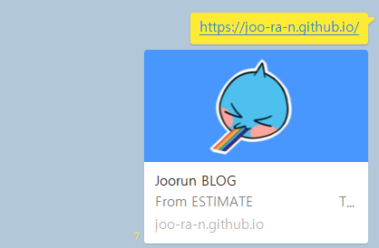  
(내가 만든 블로그 오픈그래프)

마지막으로.. DISQUS라는 API를 이용하여 포스트의 댓글 기능을 구현할 텐데, ~~고맙게도~~ 블로그 원래 주인 분께서 잘 짜 놓으셔서 처음에는 DISQUS API가 포스팅 하단에 잘 붙어 있을 것이다.
하지만 `_config.yml` 파일의 `shortname` 부분을 수정해야 진정 내 블로그에 내 DISQUS가 붙게 되는데, 이를 위해서는 DISQUS 가입과 신뢰할 수 있는 사이트 추가만 해주면 된다.
[여기](https://disqus.com/admin/settings/advanced/)를 누르고, 아래쪽 I wanna... 뭐시기를 누르면 초기 페이지 설정이 뜨는데, 거기에 trusted domain에 `"username".github.io`를 추가해 주면 DISQUS가 포스팅 하단에 잘 붙는 것을 확인할 수 있을 것이다.   
 
## 블로그 제작 후
지금까지 우리는 HTML로 페이지를 작성하고, CSS로 꾸미고, Github을 통해서 페이지를 호스팅해봤습니다.  
그런데, `username.github.io`라는 주소는 아직 너무 불편합니다. `DNS`를 배우면서 우리가 원하는 주소로 바꿔봅시다.  

### DNS?  

DNS란 `Domain Name System`의 약자로, 쉽게 말해서 도메인 주소와 네트워크주소를 연결해주는 시스템이라고 생각하면 된다.  
지금은 우리가 `Github`을 통해서 호스팅을 했지만 실제 사이트를 호스팅 할 때에는 처음에는 서버컴퓨터의 IP 주소를 이용해서 호스팅 하게된다.  
예를 들어 주소창에 `125.209.222.141`을 검색하면 곧바로 네이버로 연결된다.  
네이버를 호스팅해주는 서버의 IP주소`(125.209.222.141)`와 도메인`(naver.com)`이 연결된 상태이다.  
그러면 우리도 주소를 받아서 우리가 만든 자기소개페이지와 연결해주자.  

#### 도메인 받기

우리가 자주 보는 도메인들을 생각해보자.  
`.com`, `.net`, `.co.kr`등으로 끝나는 주소들이 떠오를 것이다.  
우리도 이런 도메인들을 사용하고 싶지만 이런 도메인들은 돈을 내고 사용해야하는 고급 도메인들이다.  
무료도메인들은 유료 서비스에 비해 속도가 느리거나, 호스팅이 불안정하다는 단점이 있지만, 연습이니까 무료로 사용할 것이다.  

구글에 `무료도메인`을 검색하면 여러가지가 나올텐데, 이번 강의에서는 `내도메인.한국`이라는 사이트를 사용해보자.  
위 사이트에 접속해 회원가입과 로그인을 하자.  
로그인을 했다면 두 개의 검색창이 보일텐데, 위쪽은 한글 도메인을 받는 검색창이고, 아래쪽은 영어도메인을 받는 검색창이다.  
취향이지만 강의는 영어 도메인을 받는 것으로 진행하겠다.  

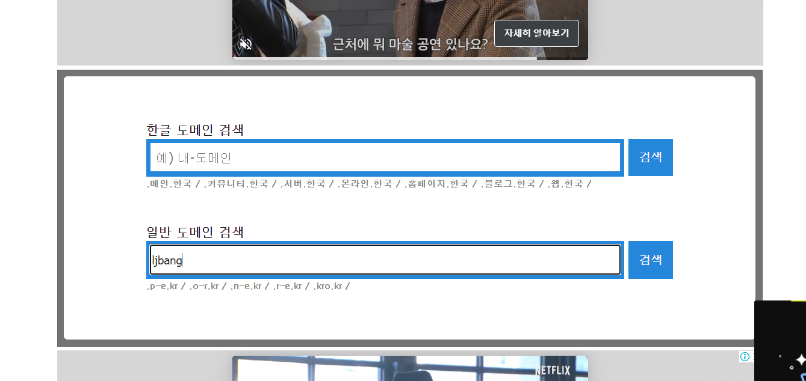  

이렇게 원하는 도메인을 검색해보면 사용할 수 있는 도메인의 목록이 나온다!  
물론 무료도메인이기 때문에 예쁜것은 없다... 맘에 드는 것을 선택하자.  
선택한 후 보안코드를 입력하고 등록을 하면 아래와 같은 페이지가 나온다.  

  

여기서 위 그림과 같이 웹포워딩을 체크한 후 자기소개페이지의 주소`username.github.io`를 넣으면 된다.  
만약 깃헙 페이지가 아닌 일반 서버를 통해 호스팅해서 주소를 연결해야 하는 경우라면 `IP연결`을 체크한 후  
IP주소를 입력하면 된다.  

모든 작업을 완료 했다면, `ljbang.kro.kr`의 형태로 주소창에 입력하면 내가 만든 페이지가 나타남을 확인할 수 있다!  


### 검색엔진에 사이트 등록 하기

홈페이지를 만들었다고 끝이 아니다!  
홈페이지를 만들었으면 우리가 홈페이지를 만들었다고 검색엔진에 알려줘야한다.  
대표적인 검색엔진인 `네이버`와 `구글`에 우리 사이트를 알려보자.  

먼저 국민 사이트 네이버부터 등록해보자  
[네이버 서치 어드바이저](https://searchadvisor.naver.com/)  
위 사이트에 접속한 후 먼저 오른쪽 위에 로그인을 눌러 네이버 아이디로 로그인하고 정보이용 동의를 체크한다.  
정보이용 동의를 체크했다면, 스크롤을 조금 아래로 내려서 `웹마스터 도구 사용하기`버튼을 클릭한다.  

  

그 다음 나오는 창에서 우리가 만든 사이트 도메인을 입력한다.  

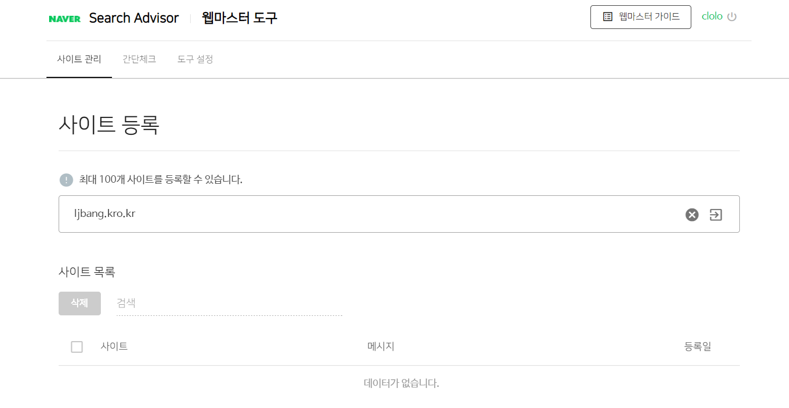  

등록을 하면 본인이 소유한 사이트인지 확인절차를 가지는데,  
두가지 방법 모두 사용할 수 있지만 간편한 방법인 `HTML 태그`를 통해서 등록해보자.  

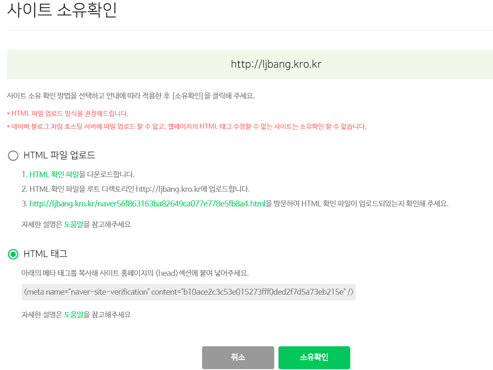  

`<meta>`태그의 내용을 복사해서 우리가 가진 `index.html`의 `<head>`태그의 아랫부분에 붙여넣는다.  

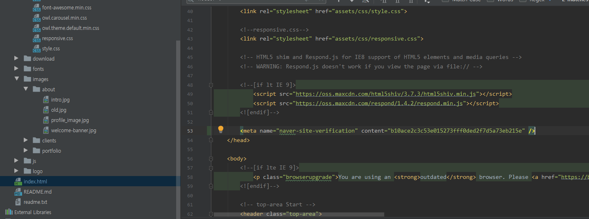  

붙여넣었다면 다시 Github으로 `push`해준다.  
우리가 호스팅하는 페이지에서 `F12`를 눌러서 `<head>`태그에서 `<meta naver ...>`태그가 정상적으로 추가되었는지 확인한다.  
확인되었다면, `소유확인`을 눌러 등록을 완료한다!  
이제 우리는 네이버에서 검색어를 통해 우리가 호스팅하는 페이지를 찾을 수 있다!  
물론 등록하는데에 시간이 조금 걸릴 수 는 있으니 차분히 기다려보자...  

이번에는 구글이다.  
구글도 마찬가지로 ‘구글 웹마스터 도구’라는 웹사이트 관리툴을 제공한다.  
[구글 서치 콘솔](https://search.google.com/search-console/about?hl=ko)   
위 사이트에서 `시작하기`를 누르면 도메인주소를 넣는 공간이 나온다.  
하나의 웹사이트 서비스라면 도메인을 입력해도 되지만 이번에는 하나의 단일 페이지이므로 URL을 입력해보자.  

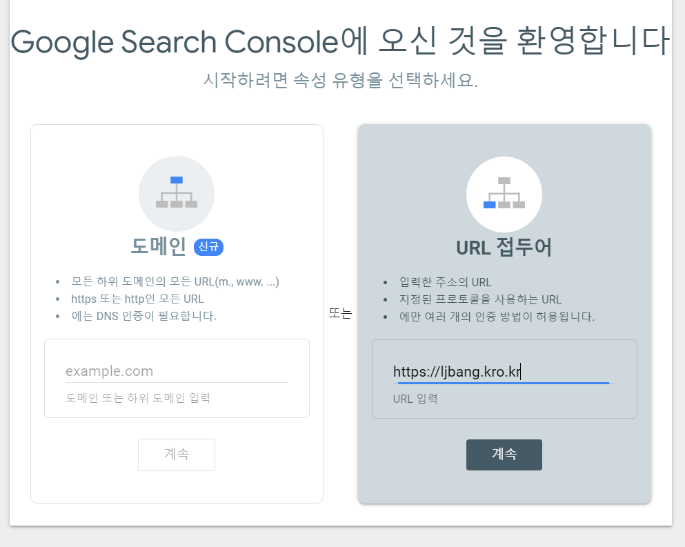  

`계속`을 누르면 네이버와 같이 소유 인증을 해야하는데, 이번에도 `<meta>`태그를 활용해서 등록해보자.  

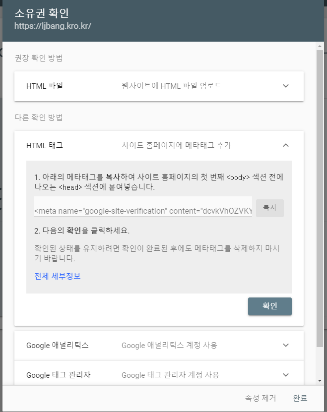  

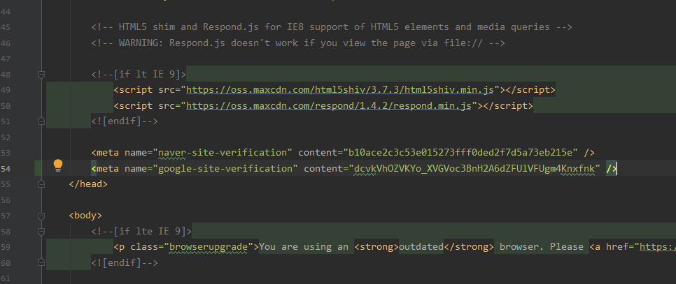  

`<meta>`태그를 추가한 뒤 Github으로 push 해주고, 웹 사이트에서 제대로 적용되었는지 확인을 마쳤다면,  
구글 서치 콘솔에서 확인을 눌러주자.

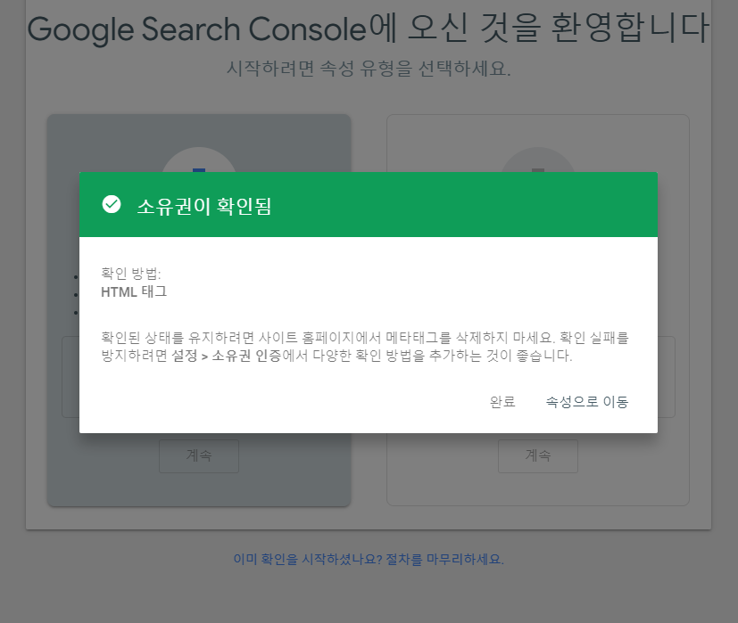
 
이제 구글에도 우리의 사이트가 등록되었다!  

사이트를 등록하면 해당 검색엔진의 검색결과에 사이트가 노출된다.
또한, 검색 시 사이트의 내용 일부를 가져다 검색결과에 보여 준다.  
사이트의 내용은 사이트를 구성하는 여러 개의 웹페이지를 말하는데,  
웹페이지에 있는 제목, 소제목, 본문, 멀티미디어 등을 모두 수집하여 색인화 한 후  
연관성 있는 키워드의 검색결과에 노출시킨다.  
즉, 내 홈페이지에 있는 키워드를 더 잘 찾아준다.  

구글에서는 웹페이지의 내용이 잘 작성될 경우 상위노출에 의한 홍보효과를 가져오게 된다.  
웹페이지를 상위노출에 유리하게 작성하는 작업을 ‘검색엔진최적화’라고 한다.  
네이버와 구글은 어떻게 해야 검색엔진에 잘 검색될지 검사도 해준다.  
이를 잘 활용한다면 내가 만든 서비스의 접속자 수가 증가할 것이다!  

구글 서치 콘솔은 사이트 등록 외에 사이트 관리에 유용한 여러가지 도구들을 제공한다.  
사이트의 오류나 기능에 대한 점검, 검색 순위, 노출 현황, 검색어, 모바일 적합성, 사이트 통계 등 다양한 분석 도구들을 활용할 수 있는데,  
이런 도구들을 활용하면 상위노출에 유리하도록 사이트를 개선할 수 있다.

### Google Analytics
그리고 Google Analytics를 사용해서 유동 클라이언트의 통계 분석을 할 수 있게 해 주면 좋다. 이를 위해 [구글 애널리틱스](https://www.google.com/analytics/)로 들어가 봅시다.
거기서 애널리틱스 로그인을 눌러서 계정을 만들고, 기본적인 계정 설정을 수행하자.

`계정 이름`은 적당히 본인의 별명이나 이름을 입력하면 되고, `측정하려는 대상`은 우리 블로그기 때문에 웹을 선택하자.
`속성 설정`에서 웹사이트 이름 또한 적당히 설정해 주고, URL은 자신의 github pages 주소로 설정해 주자. 필자의 경우 `https://Joo-ra-n.github.io`이다.

업종 카테고리는 일단 기타로 설정해 두고, 보고 시간대를 대한민국으로 설정해 주자. 그러면 사용 약관 계약서가 뜨는데, 거주 국가를 대한민국으로 바꿔주고 동의해주자.

그러면 추적 ID와 범용 사이트 태그 부분이 나오는데, 추적 ID는 복사해서 `_config.yml` 파일의 Google Analytics 부분을 수정해주고,
범용 사이트 부분을 알맞게 수정해 주면 등록이 완료되게 된다.
