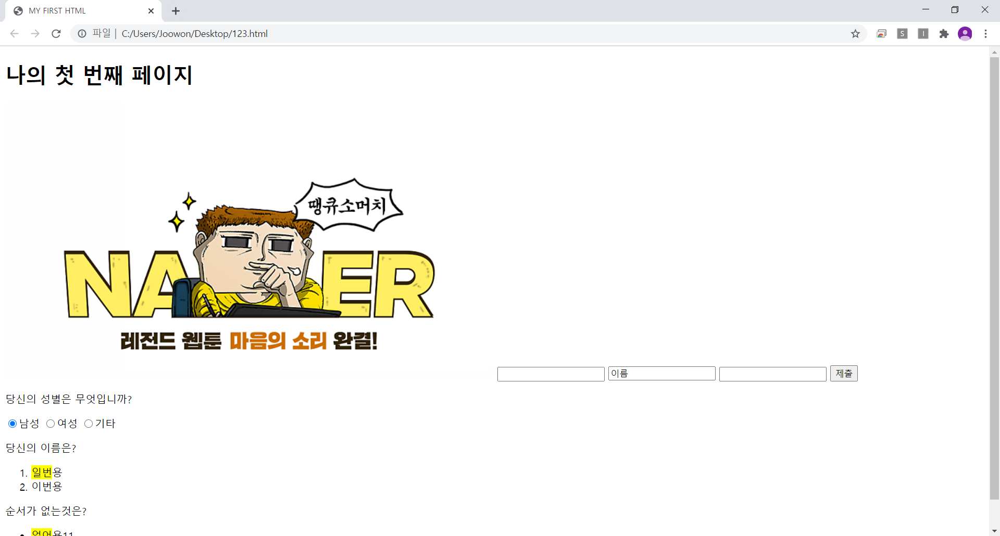

# HTML


~~프로그래머를 괴롭히는 방법~~

### 무작정 따라해보기!
일단 메모장을 켜자. 그리고 아래의 코드를 복사(ctrl+c), 붙여넣기(ctrl+v) 해보자!
```
<!DOCTYPE html>
<html>
    <head>
        <title>HELLO HTML</title>
        <meta charset='utf-8'>
    </head>
    <body>
        <h3>대충 제목이 들어갈 자리</h3>
        <p>대충 내용이 들어갈 자리입니다.
        <p>대충 내용이 들어가는 중입니다. 간장 공장 공장장입니다.</p>
    </body>
</html>
```
실행해보면 아래와 같이 나올 것이다.
 
  
보면 우리가 입력했던 코드 중 &lt;title&gt;, &lt;h3&gt;, &lt;p&gt;들을 `태그`라고 하는데, 아까 경북대학교 총학의 예시를 봐도 그렇고 html 문서는 이 태그들로 이루어져 있다. 
처음 웹이 나왔을 때는 20개 정도의 태그들이 있었다고 하는데, 현재는 약 150개 이상의 태그들이 있다고 한다.
하지만 우리가 그 태그들을 다 알아야 할 필요는 없고,  
  
  
위 그래프들을 참조해 보면, 위쪽 그래프는 페이지당 평균 태그 수를, 아래쪽 그래프는 가장 많이 사용되는 25개 태그를 나타낸 것이다. 우리가 무작정 따라해봤던 태그 중 &lt;html&gt;, &lt;head&gt;, &lt;body&gt;, &lt;title&gt; 태그 등이 포함되어 있다! 아래로 걸출한 태그들이 나와 있는데,
이 태그및 다른 태그들을 알아보고, 이를 활용해 간단한 예제 페이지들을 만들어 보자.

#### &lt;a&gt;
anchor의 약자로, 하이퍼링크를 걸 때 사용한다.
```
<a href="https://www.naver.com" target="_blank" title="네이버로 이동">네이버</a>
```

#### &lt;img&gt;
image의 약자로, 이미지를 넣을 때 사용한다.
```

```
width는 폭, height는 높이, alt는 이미지 대체 속성이다. 스크린 리더 프로그램을 활용할 때에 alt 속성을 활용하기 때문에 꼭 넣어주는 편이 좋다.

#### &lt;h1&gt; ~ &lt;h6&gt;
```
<h1>h1 태그입니다.</h1>
<h2>h2 태그입니다.</h2>
<h3>h3 태그입니다.</h3>
<h4>h4 태그입니다.</h4>
<h5>h5 태그입니다.</h5>
<h6>h6 태그입니다.</h6>
```
#### &lt;p&gt;
```
<p>안녕 이것은 문단 태그야.</p>
```
본문에 해당하는 내용을 적을 때 주로 사용하는 태그로, paragraph 즉 단락을 표현할 때 사용한다.
#### &lt;span&gt;
```
<p>안녕 이것은 문단 태그야.<span>span태그</span>를 설명하기 위해 잠깐 가져왔지.</p>
```
그냥 봤을 때는 일반 텍스트와 동일하게 출력되기 때문에 CSS 언어와 함께 사용한다.
```
<p>안녕 이것은 문단 태그야.<span style="color: red;">span태그</span>를 설명하기 위해 잠깐 가져왔지.</p>
```
이런 식으로 말이지...
#### &lt;mark&gt;
```
<p><mark>대구소프트웨어고등학교</mark>는 대구광역시 달성군 구지면에 있는 고등학교이다.</p>
```
형광펜을 칠한다고 생각하면 쉬울려나?
#### &lt;ol&gt;, &lt;ul&gt;, &lt;li&gt;
ol 태그는 ordered list(번호 있음)  
ul 태그는 unordered list(번호 없음)  
li 태그는 listed item의 약자로 뭔가 아이템 앞에 적어줄 때 사용한다.
```
<ol>
    <li>번호가 있는 ol태그 1</li>
    <li>번호가 있는 ol태그 2</li>
    <li>번호가 있는 ol태그 3</li>
</ol>
<ul>
    <li>번호가 없는 ul태그 1</li>
    <li>번호가 없는 ul태그 2</li>
    <li>번호가 없는 ul태그 3</li>
</ul>
```

#### &lt;br&gt;
```
br태그는 강<br>제개행을 할 때 쓰입니다. 개행은<br>엔터라고 생각하면 편합니다.
```
#### &lt;input&gt;
```
        <input type="text">
        <input type="text" value="이름">
        <input type="password">
        <input type="submit" value="제출">
        <p>당신의 성별은 무엇입니까?</p>
        <input type="radio" name="gender" value="남성">남성
        <input type="radio" name="gender" value="여성">여성
        <input type="radio" name="gender" value="기타">기타
```
input 태그의 활용은 정말로 정말로 무궁무진 하기 때문에 여기서 모두 설명할 수 없고, radio나 password submit 등 굵직굵직한 type들만 보여주었다. 사실 모든 type을 어떻게 쓰는지 세세하게 알고 있을 필요는 딱히 없고,
아! 이런 type도 있었지.. 정도만 기억하고 있다가 실제로 사용할 때 구글링해서 쓰시면 됩니다.

[w3schools에서 설명하는 input type 속성값 종류](https://www.w3schools.com/html/html_form_input_types.asp)  
[HTML - input태그와 그 속성 type, value, name - 입력태그 (1)](https://yangbari.tistory.com/28)  
[HTML - input태그의 추가된 속성과 type 속성에 추가된 값 - 입력태그 (2)](https://yangbari.tistory.com/29)

### 무작정 섞어보기
이때까지 배운 것들을 죄다 한군데 넣어서 써보자! 아래는 그냥 예시일 뿐이다! 복사 붙여넣기 하지 말고 귀찮더라도 직접 해보자!
```
<!DOCTYPE html>
<html>
    <head>
    <meta charset='utf-8'>
    <title>MY FIRST HTML</title>
    </head>

    <body>
    <h1>나의 첫 번째 페이지</h1>
    <a href="https://www.naver.com" target="_blank"></a>
    <input type="text">
    <input type="text" value="이름">
    <input type="password">
    <input type="submit" value="제출">
    <p>당신의 성별은 무엇입니까?</p>
    <input type="radio" name="gender" value="남성">남성
    <input type="radio" name="gender" value="여성">여성
    <input type="radio" name="gender" value="기타">기타<br>
    
    <p>당신의 이름은?</p>
    <ol>
        <li><mark>일번</mark>용</li>
        <li>이번용</li>
    </ol>
    <p>순서가 없는것은?</p>
    <ul>
        <li><mark>없어</mark>용11</li>
        <li>없어용22</li>
    </ul>
    
    </body>
</html>
```

#### 실행 화면
