## 템플릿을 이용해서 홈페이지 만들기

인터넷 상에는 전문가들이 부트스트랩을 이용해서 만든 무료(혹은 유료)템플릿들이 많이 있다.  
이번 시간에는 이 템플릿을 이용해서 나를 소개하는 페이지를 만들고, github page에 호스팅해보자!  

### 템플릿 찾기  
구글에 `Free bootstrap template`을 검색해보자.   

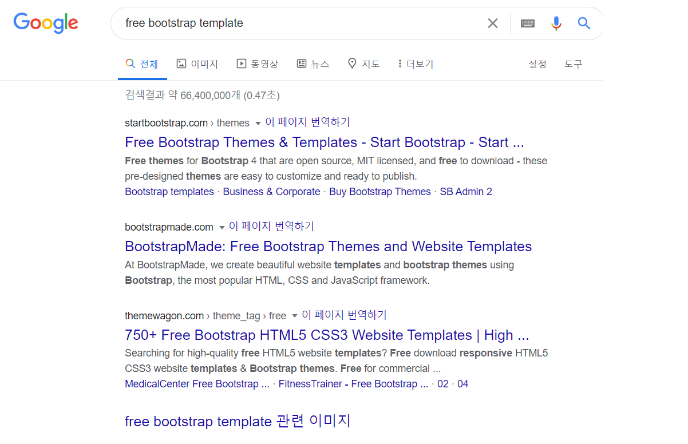  

이번 강의에서는 `750+ Bootstrap ... `사이트에 들어가보자.  
이곳에서 우리가 이번시간에 사용해볼 템플릿은 `browny`라는 템플릿이다.  

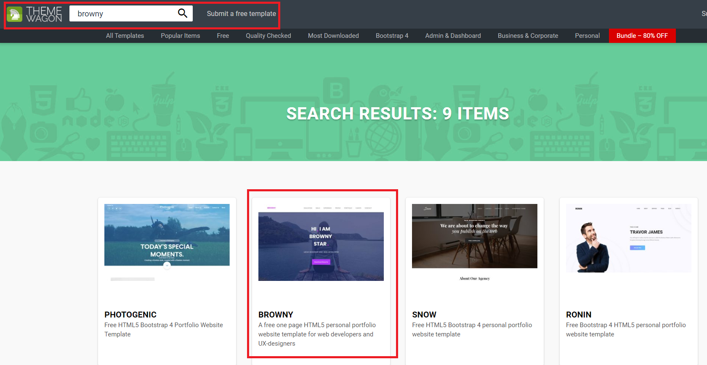  

`Download Free`버튼을 눌러서 `.zip`파일을 다운로드 받도록 하자.  
이번 시간에는 자기소개페이지를 만들 것이므로 `username.github.io`프로젝트를 열어서  
`.zip`안의 파일을 모두 프로젝트 안으로 옮겨준다.  

  

자 그럼 `index.html`파일을 열어보자.  
그러면 페이지가 나타나는데, 앞으로 우리는 이 파일을 바꾸어서 자기소개 페이지를 만들 것이다.  
그러면 우리가 파일의 어떤 부분을 바꾸어야 페이지가 바뀔까? 구글을 기준으로 `F12`를 눌러보자.  

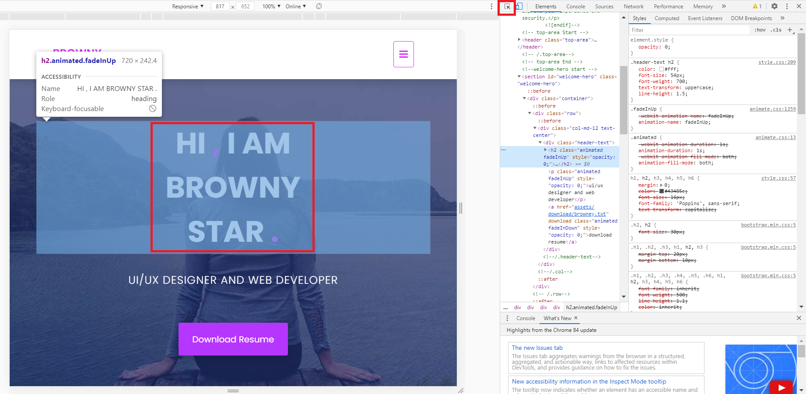  

그러면 위와 같은 창이 나타날텐데, 오른쪽 위에 표시된 것과 같이 사각형에 커서가 있는 아이콘을 누른 후,  
우리가 바꾸고 싶은 영역을 클릭해보자. `HI, I AM ...`부분을 바꿀 것이므로 이 영역을 눌러보도록 하겠다.
그러면 오른쪽에 선택한 영역에 대한 코드가 나타난다. 이부분을 바꾸면, 우리가 선택한 영역을 바꿀 수 있다.  

영역을 확인했다면 `index.html`로 돌아와서 우리가 확인한 영역을 바꿔보자.  

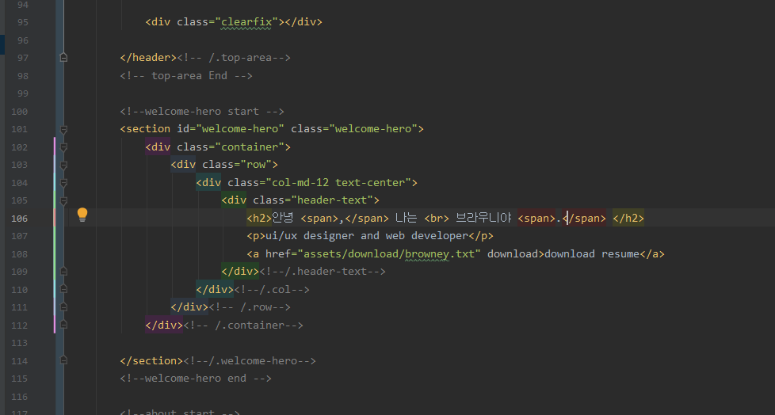  
  

글자를 바꾸었다면, 이번에는 사진도 바꾸어보자.  

그런데, 사진을 바꾸려고 `F12`를 눌러서 확인해봤더니, `index.html`파일에는 관련 코드가 없다.  
대신 `html`코드 옆에 보니 아래와 같이 사진에 대한 정보가 나타난다.  

  

이 부분은 `html`파일에 적용된 `CSS`를 확인할 수 있는 부분인데, 이 부분은 사진을 `html`파일이 아닌 `css`파일에서 적용했음을 알 수 있다.  
이 부분을 다른 사진으로 바꿔보자.  
먼저 위에서 확인한 대로 `assets/css/style.css`파일을 열어보자.  
상당히 긴 `css`코드가 나오는데 우리는 `welcome-banner.jpg`파일을 바꿀 것이므로, `ctrl+f`를 눌러서 바꿀 파일을 검색하자.  
우리가 넣고 싶은 사진 파일은 `assets/images/about`폴더 안에 넣고, `style.css`파일에서 참조해주자.  
여기서는 `intro.jpg`파일을 임의로 구해서 넣어보겠다.

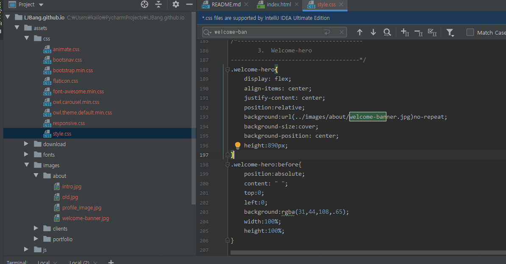  

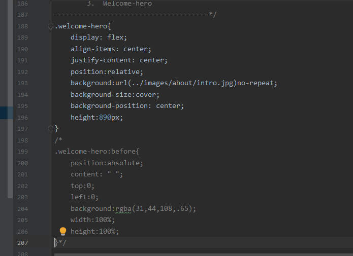  

사진을 `intro.jpg`사진으로 바꾸고, 사진을 덮고있는 투명한 보라색 레이어를 주석처리하였다.  
결과는 아래와 같이 투명한 레이어가 없어진 사진이 배경으로 바뀌었다.  

  

물론 사진이 `.css`파일이 아니라 `.html`파일에서 지정되어 있을 수도 있다. 그럴때는 `.html`파일을 바꿔주면 된다.  

자, 우리는 이제 글도 바꿀 수 있고, 사진도 바꿀 수 있다. 
그런데 스크롤을 조금만 내려보면, 여러가지 아이콘들이 나온다. 이 아이콘들을 한번 바꿔보자.  

먼저 이 아이콘들이 `.html`코드 중 어디에 있는지 확인해보자.  

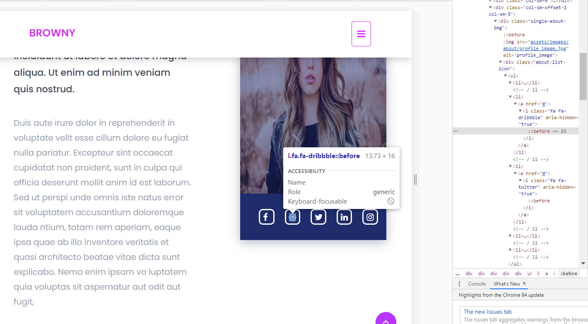  

```html
<i class="fa fa-dribbble" aria-hidden="true"></i>
```  
위 코드로 구성되어 있음을 알 수 있다. 여기서 `fa`란 `font-awesome`의 약자인데 웹 폰트나 아이콘을 제공해주는 툴킷이다.  
이 글을 쓰는 현재 6버전까지 나와있고, 이 부트스트랩 템플릿에서는 4.7버전을 사용하고 있다.  
  

4.7버전에서 사용할 수 있는 아이콘들을 구글에 검색해보자.  

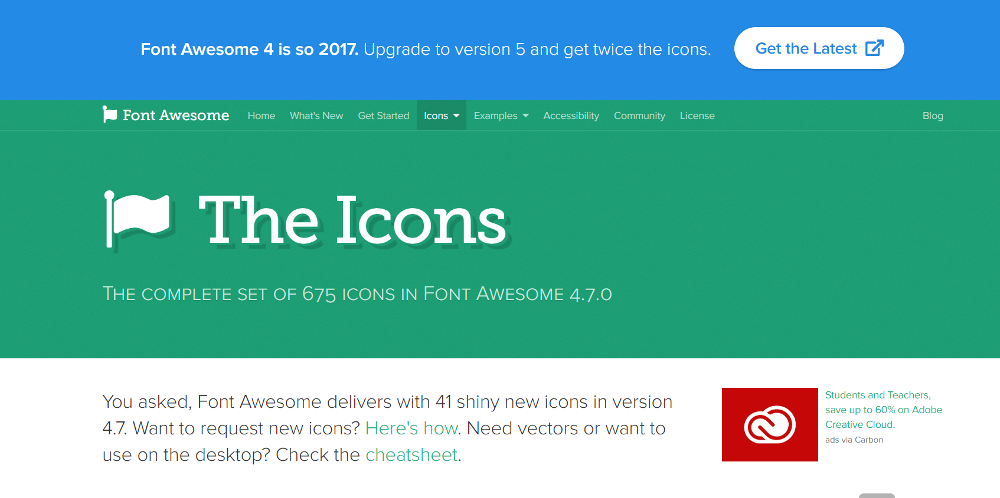  

Font Awesome 4.7버전의 홈페이지다. 여기서 `icons`를 클릭해서 원하는 아이콘을 검색해보자.  
원래 아이콘이 농구공 모양이었으므로 이번에는 별모양으로 바꾸기 위해 `star`를 검색해서 아이콘을 찾았다.  

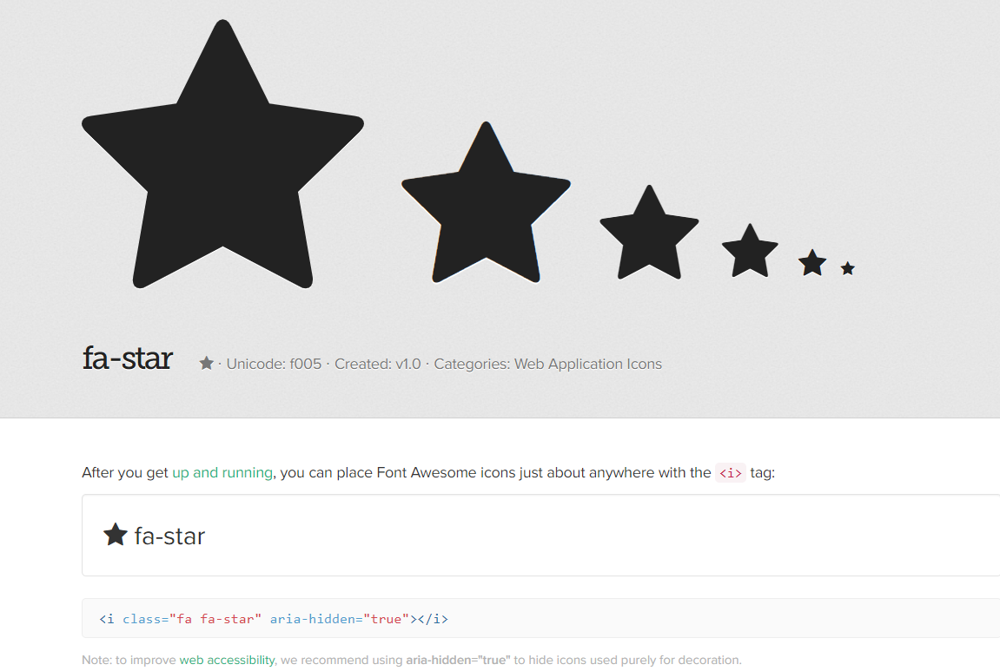  

밑에 이 아이콘을 출력할 수 있는 코드가 보일 것이다.  
이 코드를 아까 확인했던 `fa-dribbble`코드와 바꾸어 주자.  

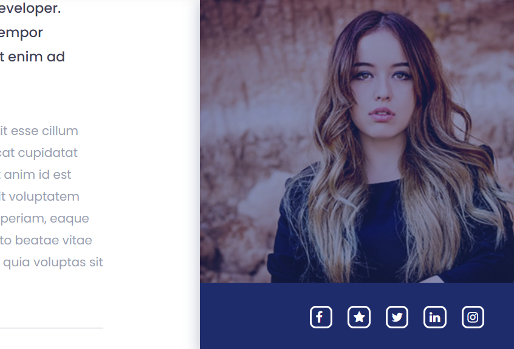  

농구공 모양의 아이콘이 별모양으로 바뀌었음을 확인할 수 있다.  
이 템플릿에서는 `Flaticon`도 사용하고 있는데 이에 대한 사용법은 [여기](https://www.flaticon.com/iconfonts)를 참조바란다.  

이제 우리는 내용물은 대부분 바꿀 수 있게 되었다. 그러면 마지막으로 글꼴을 한번 바꿔보자.  
글꼴은 `css`를 사용해서 바꿀 수 있는데, 이번에는 여러가지 무료 웹 폰트를 제공하는 `눈누`에서 폰트를 다운받아 사용해보자.  

먼저 구글에 눈누를 검색해서 홈페이지에 들어간다.  
검색등을 사용해서 원하는 폰트를 찾는다.  

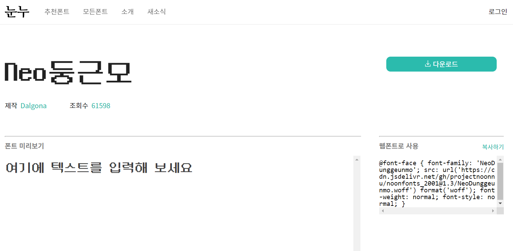  

여기서 다운로드가 아닌 그 아래에 `웹폰트로 사용`부분에 있는 `복사하기`버튼을 눌러 코드를 복사한다.  
복사한 코드를 `style.css`의 코드가 시작하는 부분 위쪽에 붙여넣기한다.  

  

그럼 글씨체가 `css`에 추가가 되었고, 적용할 부분을 찾아서 적용시켜주어야 한다.  
위에서 바꾼 제목부분의 글씨체를 바꿔보자.  
제목 부분은 `header-text`클래스 안의 `<h2>`태그이다. `.css`파일에서 이 부분을 찾아서 바꿔보자.  

  
```css
font-family: 'font_name';
```
위 형태의 코드를 추가해주면 된다. 폰트의 이름은 눈누에서 가져온 코드에 명시되어 있다.  

이제 `index.html`파일을 새로코침 해보면 폰트가 바뀌었음을 확인할 수 있다.  

  

지금까지 부트스트랩이 무엇인지, 어떻게 사용하는지를 배웠고,  
사람들이 만들어 놓은 템플릿을 이용해 자기소개 페이지를 꾸며보는 시간을 가졌다.  
이제 이 파일들을 github에 업로드 해서 `username.github.io`를 통해서 호스팅해보자!  
