# 자기소개페이지 만들기  
자기소개페이지를 만들어보고 github의 웹호스팅 서비스를 사용해봅시다.  
먼저 서버와 클라이언트의 개념을 잡고 시작하겠습니다.  
## 서버, 클라이언트 그리고 웹호스팅
### 서버와 클라이언트  
여러분은 _서버_ 와 _클라이언트_ 가 무엇인지 알고 계시나요?  
아마 프로그래밍을 공부하고 계시다면 다들 한번쯤은 들어보셨으리라 생각합니다.  
클라이언트/서버는 두개의 컴퓨터 프로그램 사이에 이루어지는 역할 관계를 나타내는 것입니다.   
클라이언트는 서비스 요청자를, 서버는 서비스 자원의 제공자를 의미합니다.  
  
예를 들어보겠습니다.  
누군가 자신의 컴퓨터에서 은행계좌 내역을 조회하려합니다.  
그럼 먼저 자기 PC의 클라이언트 프로그램이 은행에 위치한 거래 서버에 요구사항을 전송하게 되고,  
거래 서버는 그 요청을 받아 은행 DB에서 해당 내용을 찾아 다시 PC의 클라이언트 프로그램으로 보냅니다.  
물론 실제로 일어나는 일은 더욱 복잡하겠지만, 서버와 클라이언트간의 통신으로 최종적으로  
고객의 화면에 은행계좌 내역이 보이게 되는 것입니다.  

여러분이 보고 있는 이 웹페이지도 서버와 클라이언트간 통신의 결과물입니다.  
여러분이 쓰고 있는 웹 브라우저 프로그램인 크롬이나 엣지가 클라이언트 프로그램입니다.  
웹 브라우저가 설치된 컴퓨터는 인터넷을 통해 주소창의 주소에 해당하는 컴퓨터에게 웹페이지를 요청합니다.  
그러면 요청받은 컴퓨터의 웹 서버 프로그램이 어떠한 디렉토리에서 해당 웹페이지 파일을 찾아 다시 전달합니다.  
이제 감이 좀 오시나요? :)  

### 웹호스팅  
그럼 이런 생각을 하게 될 것입니다.  
'그럼 내가 자기소개페이지를 HTML과 CSS를 이용해 만들고 나서, 다른 사람에게 보여주려면 웹 서버가 필요하겠구나.'  
  
웹 서버를 구현하는 방법은 크게 2가지가 있습니다.  
1. 직접 컴퓨터에 웹 서버 프로그램을 설치한다.
2. 웹호스팅 서비스를 사용한다.  
    
직접 컴퓨터에 웹 서버 프로그램을 설치하고 각종 설정을 하는 것은 얻는 것은 많지만 쉽지 않은 과정입니다.  
그래서 우리는 이번에 만들 자기소개 페이지를 제공하기 위해 웹호스팅 서비스를 사용할 것입니다.  
인터넷에 연결된 컴퓨터를 호스트라고 하며, 이런 컴퓨터를 빌려주는 것을 호스팅이라고 합니다.   
그럼 웹호스팅은 무엇일까요?  
웹 서버를 전문적으로 빌려주는 서비스를 의미합니다!  
웹 호스팅 서비스를 이용하면 쉽게 웹 서버를 구현할 수 있습니다.
다양한 웹호스팅 서비스가 존재하지만 이번에는 github에서 제공하는 웹호스팅 서비스를 사용해봅시다.    
아 웹 호스팅 부분은 과제로 나갈 예정입니다:)   

## 자기소개페이지 만들어 보자!  
자 지금부터 자기소개페이지를 만들어 봅시다!  
하지만 HTML과 CSS에 대해 아직 잘 모르는 우리가 처음부터 아름다운 웹페이지를 만드는 것은 불가능에 가깝습니다.  
그래서 우리는 Bootstrap template을 이용할 것입니다.  

### 부트스트랩 템플릿을 이용해 만들자
부트스트랩은 트위터에서 시작된 오픈 소스 프론트엔드 라이브러리입니다.  
쉽게 말해 웹페이지 제작자들이 글자, 인용문, 목록같은 것들부터 시작해 드롭다운 메뉴, 버튼, 탭, 리스트, 진행 바 등   
웹페이지에서 많이 쓰이는 요소들을 쉽게 사용할 수 있게 만들어 놓은 것입니다.  
그리고 많은 사람들이 부트스트랩 템플릿을 만들어 놓았습니다. 이 템플릿을 가져와서 수정하면 HTML, CSS를 잘 몰라도  
예쁜 웹사이트를 만들 수 있습니다. PPT의 템플릿을 떠올리시면 됩니다 :)

먼저 구글 검색창에 Free Bootstrap template을 검색합시다.   
그리고 제일 상단의 웹사이트로 들어갑니다.  
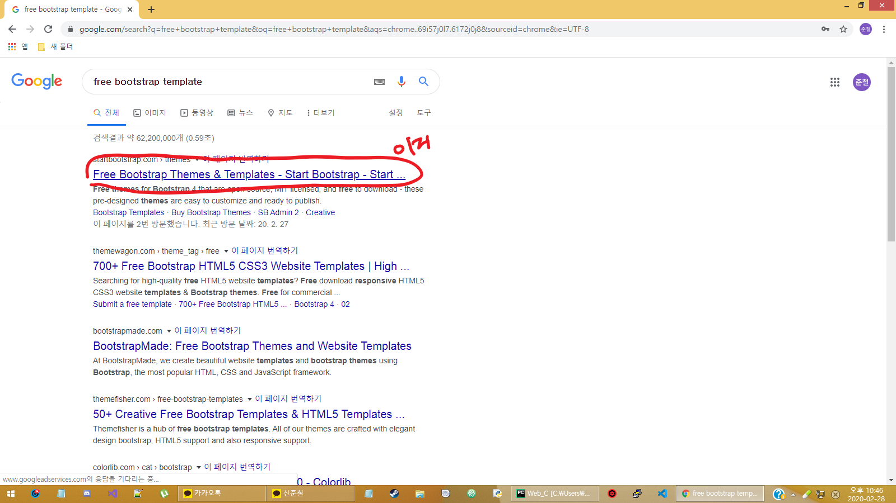  
  
다양한 무료 템플릿들이 있는걸 확인할 수 있습니다.  
Free로 표시된 템플릿들중 마음에 드는것을 하나 골라 들어갑시다.  
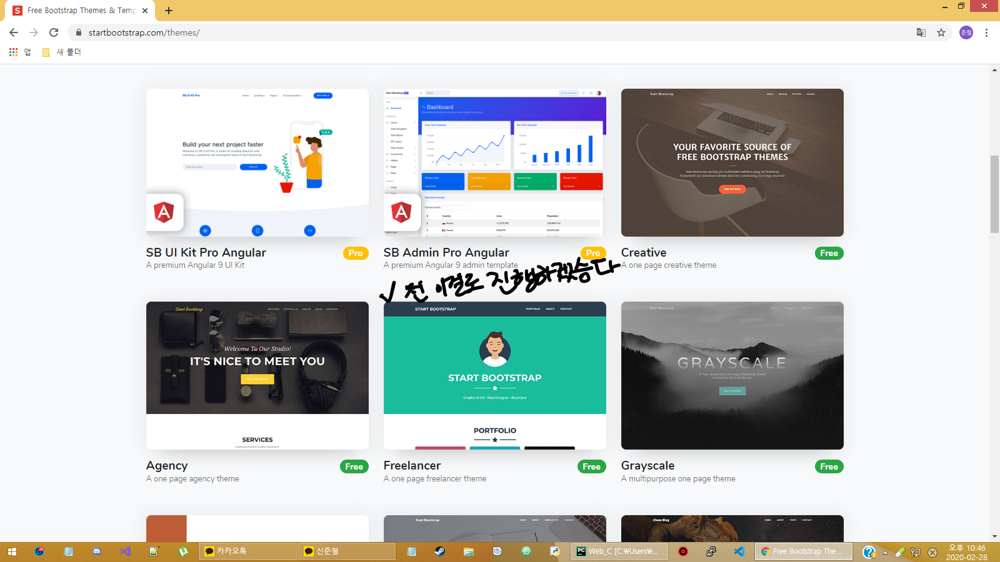  
  
Free Download를 눌러 압축된 파일을 받고 빈 폴더에 풀어줍니다.  
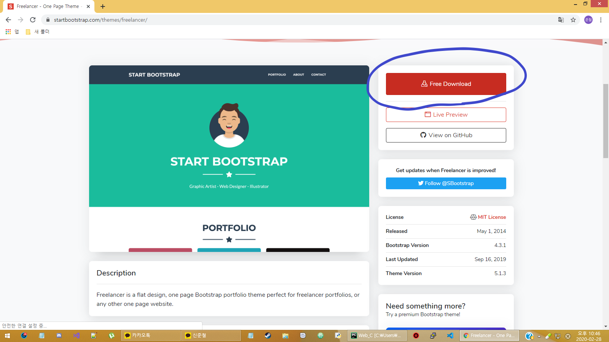  
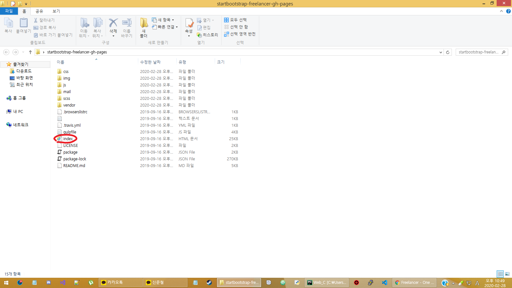  
  
여러가지 파일이 있는 것을 확인할 수 있습니다.  
이 중 index.html이 여러분이 실제로 보는 페이지입니다. 브라우저로 열어서 확인해봅시다.  
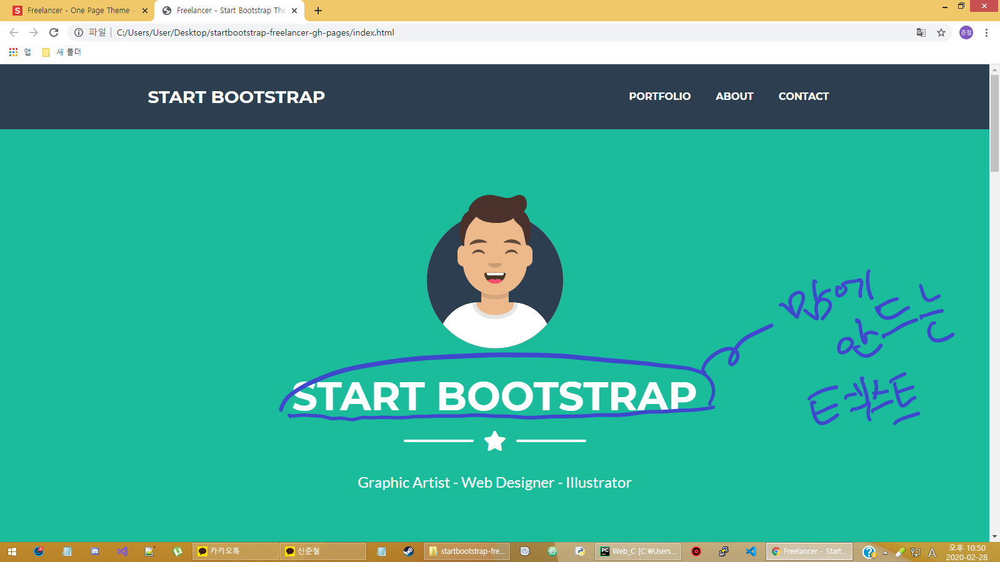
  
먼저 텍스트부터 바꿔보겠습니다.  
START BOOTSTRAP이라는 텍스트를 제 이름으로 바꾸어보겠습니다.   
크롬 개발자 도구를 사용하면 여러분이 고치고 싶은 부분이 코드의 어느부분인지 쉽게 확인할 수 있습니다.    
(PPT에서 크롬 개발자도구 설명 필수)  
크롬 브라우저에서 index.html을 열고 F12를 눌러보세요.  
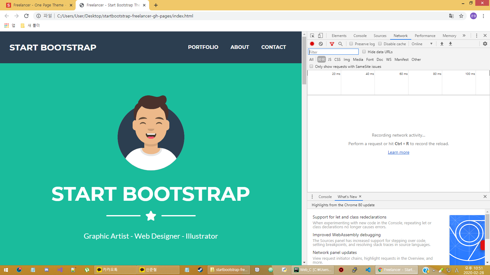  
  
개발자 도구가 나타나는 것을 보셨나요?  
이 중 Elements 항목을 누르면 index.html의 소스가 나타납니다.     
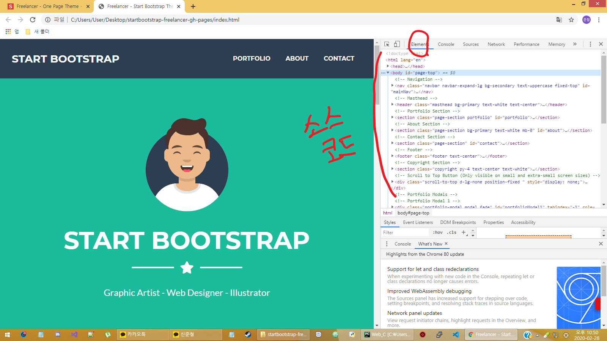  
  
개발자 도구 좌측 상단의 마우스 커서 버튼을 누르고 브라우저의 START BOOTSTRAP 위로 마우스 커서를 옮겨봅시다.  
Elements에 마우스 커서가 올라가 있는 부분이 소스코드의 어디에 해당하는지 표시됩니다. 신기하죠? :)  
h1.masthead-heading.text-uppercase.mb-0 안의 Start Bootstrap 텍스트를 고치면 되겠군요!   
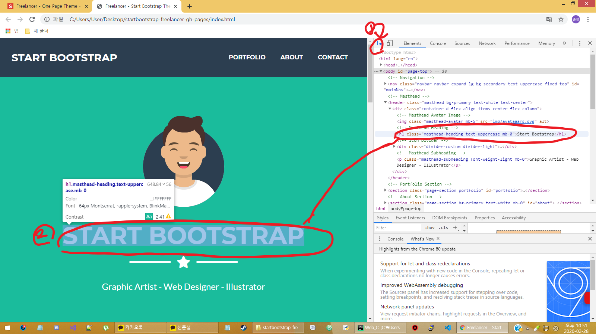  
  
여러분의 에디터로 돌아와 아까 찾은 부분을 고칩시다.   
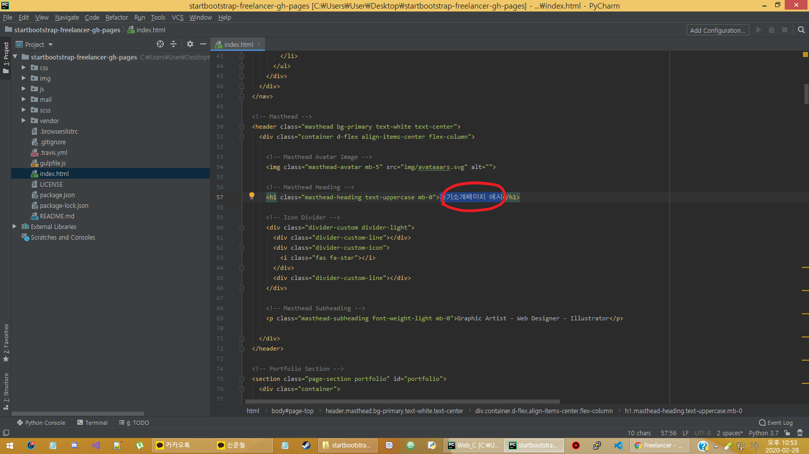  
  
새로고침하여 브라우저에서 텍스트가 성공적으로 바뀐 것을 확인할 수 있습니다.   
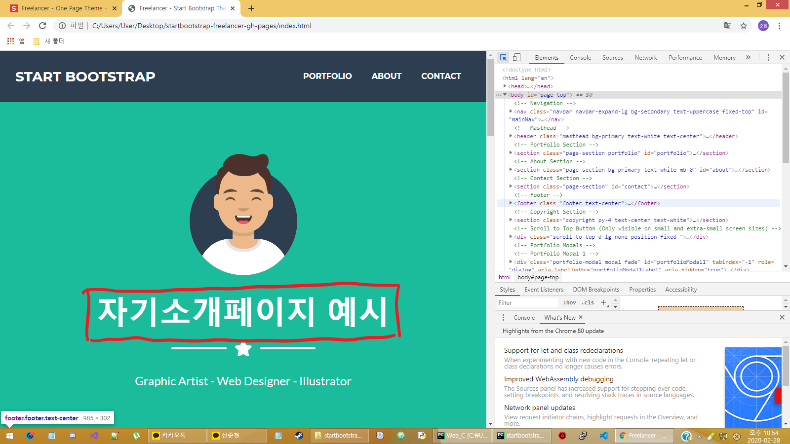  
  
크롬 개발자 도구로 고칠부분을 확인하고 에디터에서 수정, 브라우저를 새로고침하여 변경사항을 확인하는 작업을  
반복하면 여러분이 원하는대로 웹페이지를 꾸밀 수 있겠죠?   
  
이번엔 이미지를 바꾸어 보겠습니다.  
텍스트를 바꾼 것까지는 좋았지만 위의 이미지가 마음에 들지 않습니다.  
해당 이미지가 어디에 해당하는지 확인합니다.  
img.masthead-avatar.mb-5에 해당하는군요!  
src 속성을 확인해서 img 디렉토리의 avataaars.svg파일을 불러오는 것을 확인할 수 있습니다.   
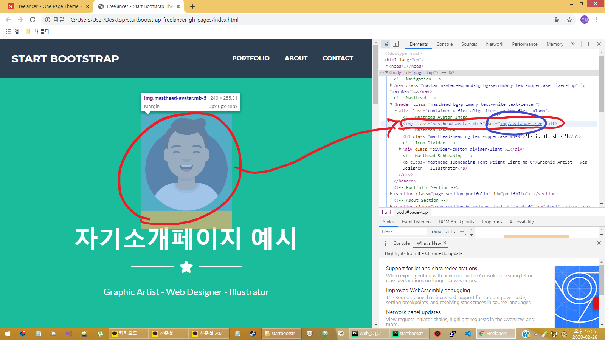   
  
에디터로 돌아와 src 속성부분을 고쳐봅시다. img 디렉토리에 원하는 이미지 파일을 넣고 src를 수정합니다.    
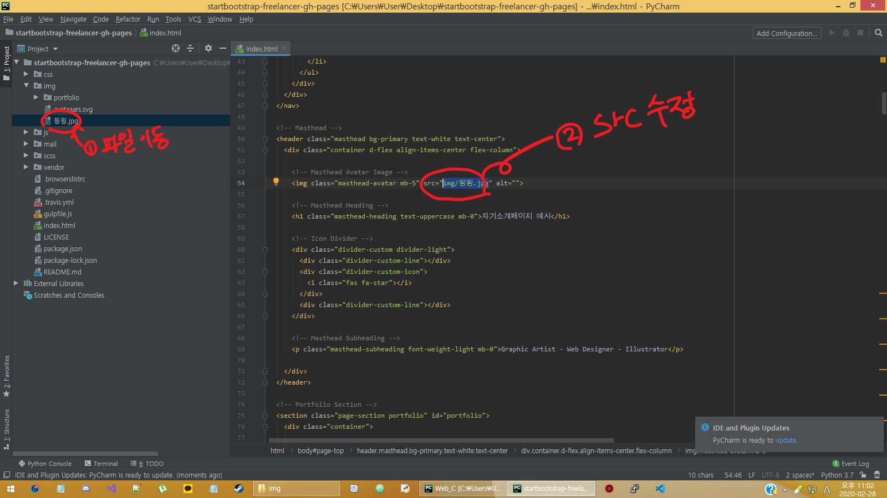  
  
짠! 이미지가 바뀌었습니다.   
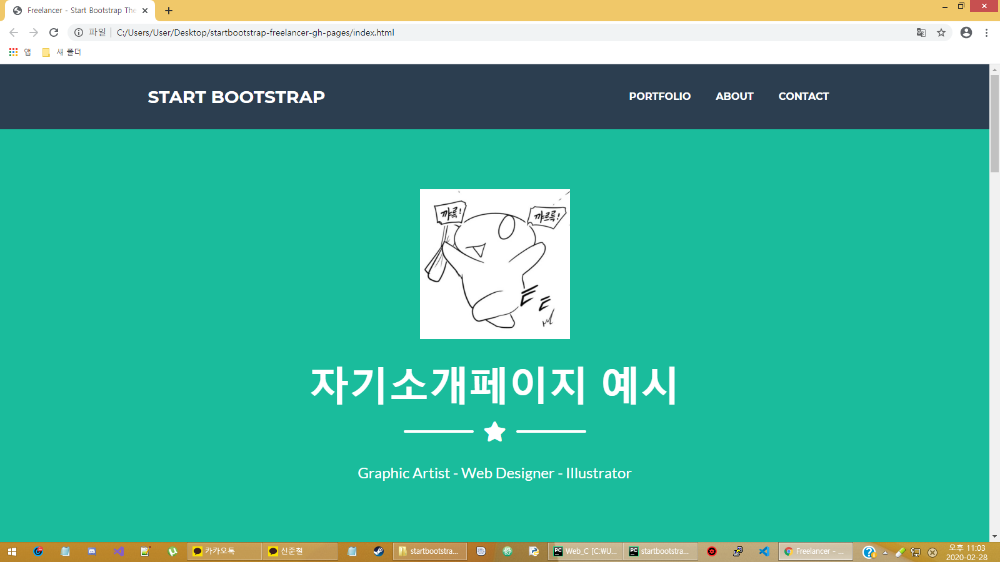  

텍스트와 이미지를 바꿨지만 이번엔 배경색이 마음에 들지 않습니다.  
개발자 도구에서 확인해봅시다.  
header.masthead.bg-primary.text-white.text-center의 배경색을 바꿔야함을 알 수 있습니다.  
선택한 요소의 CSS는 Styles에서 확인할 수 있습니다.  
확인해 보니 freelancer.min.css파일에서 background-color를 지정하고 있군요.    
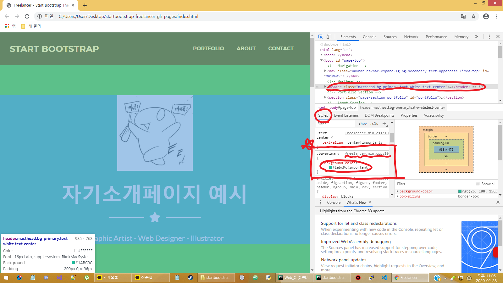  

에디터에서 freelancer.min.css를 열고 Ctrl+F로 해당내용을 찾아 수정합니다.  
저는 파란색으로 바꿔보겠습니다.(헥스코드를 써도 됩니다.)     
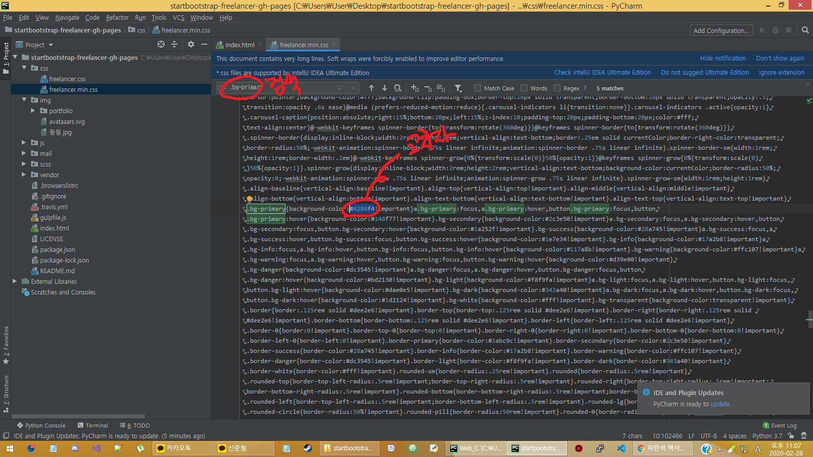  

배경색이 파랑으로 변했습니다.   
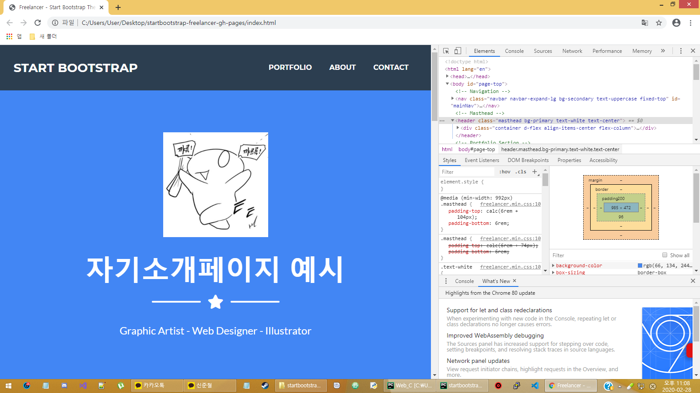  

이번에는 링크를 바꿔보겠습니다.  
제일 하단의 AROUND THE WEB 부분이 보이시나요? 픽토그램을 클릭해 다른 웹페이지로 넘어갈 수 있지만  
현재 아무 설정도 하지 않아 링크가 작동하지 않습니다.  
개발자 도구를 열어 확인해봅시다. a.btn.btn-outline-light.btn-social.mx-1 태그의 href 속성을 설정하면 될 것 같습니다.    
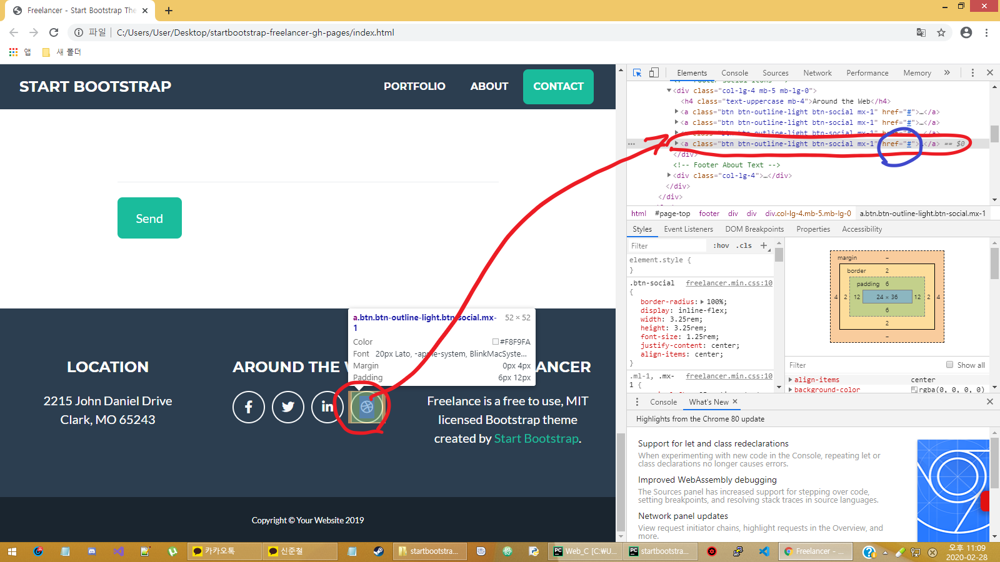  

에디터에서 a태그의 href속성을 수정합니다.  
저는 제 깃허브 페이지로 연결하겠습니다.   
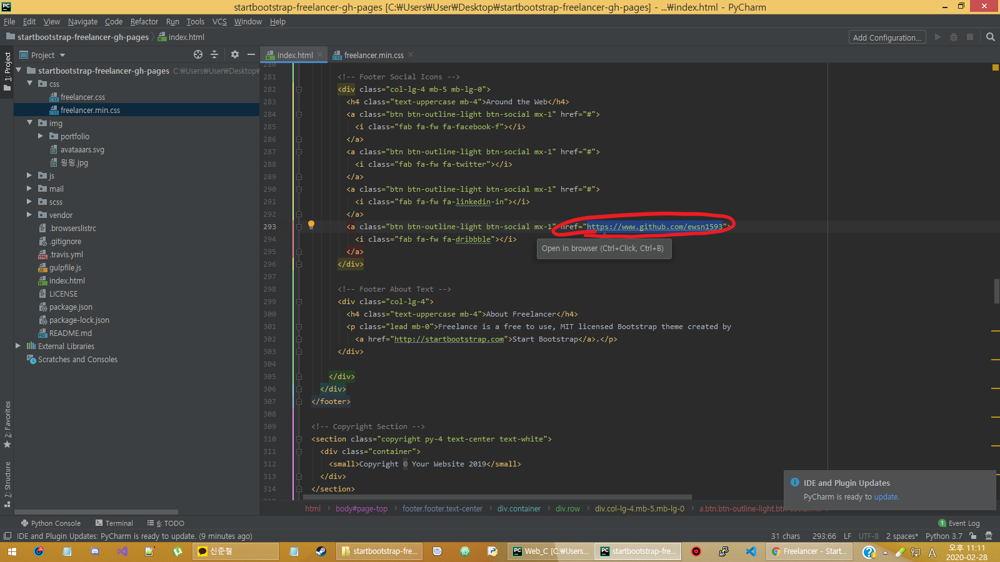  
  
링크가 고쳐졌습니다 :)  
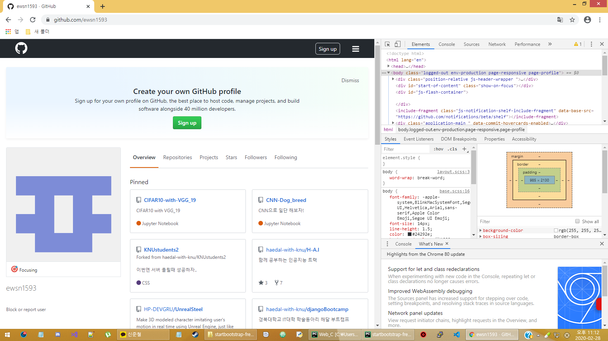

링크를 고치고 보니 아이콘이 마음에 안드는군요. 깃허브 아이콘으로 변경해보겠습니다.  
저흰 Font Awesome을 사용해 아이콘을 바꿀 것입니다.  
Font Awesome은 CSS 및 LESS를 기반으로하는 글꼴 및 아이콘 툴킷입니다. Bootstrap과 함께 사용하도록 만들어졌으며  
나중에 BootstrapCDN에 통합되었습니다.  
간단히 하면, Bootstrap에서 Font Awesome을 사용하면 다양한 아이콘을 쉽게 넣을 수 있습니다.  
  
먼저 Font Awesome에 접속해 원하는 아이콘을 찾아봅시다.  
구글에 Font Awesome을 검색하고 제일 상단의 사이트로 접속합니다.  
그리고 좌측 상단의 검색창에 원하는 아이콘을 검색합니다.  
저의 경우 github을 검색하였습니다.    
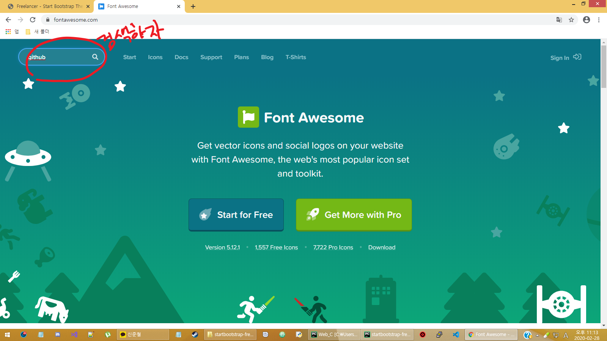   
  
검색 결과 다양한 아이콘들이 보입니다.  
이 중 마우스를 올렸을 때 Pro 표시가 되는 것은 유료 아이콘이니 다른 아이콘을 사용하도록 합시다.  
원하는 아이콘을 찾아 클릭합니다.  
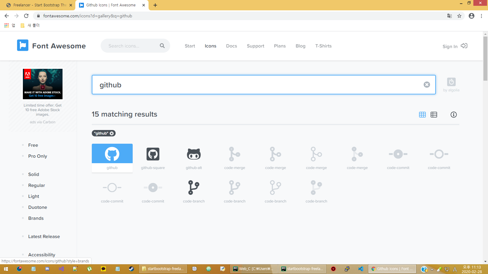  
  
Start Using This Icon을 클릭하면 이 아이콘을 사용하기 위한 코드를 가르쳐줍니다.  
이 코드를 복사해주시기 바랍니다.  
제 경우는 아래와 같습니다.   
```html
<i class="fab fa-github"></i>
```   
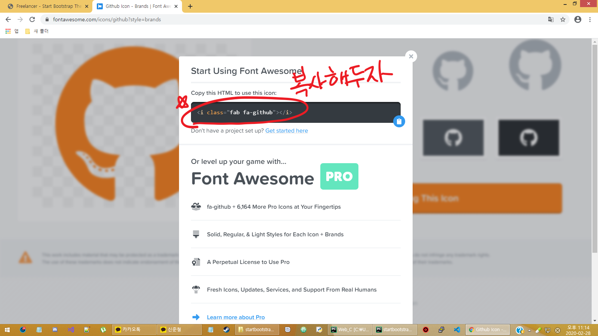  

다음으로 바꿀 아이콘 요소가 무엇인지 파악합니다.  
당연히 개발자 도구를 활용해야겠죠?  
i.fab.fa-fw.fa-dribble에 해당하는군요   
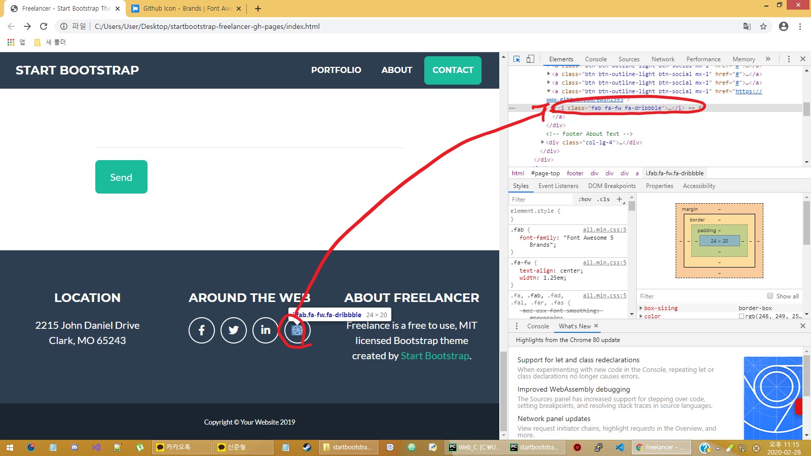  
  
에디터에서 해당 부분을 바꿔치기 해줍시다.  
다른 건 class 속성뿐이니 이부분만 수정합니다.  
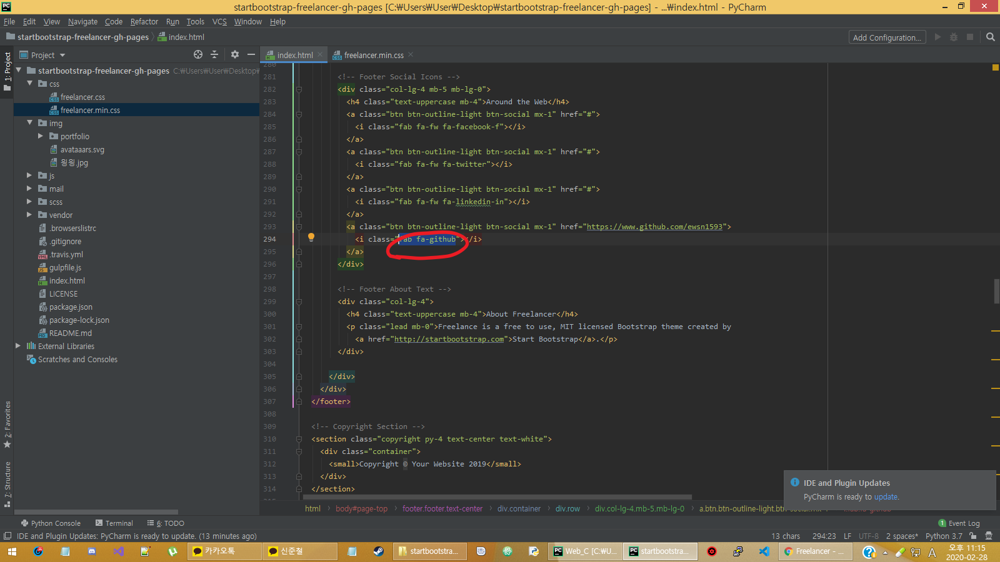  

브라우저에서 아이콘이 바뀐 것을 확인할 수 있습니다!  
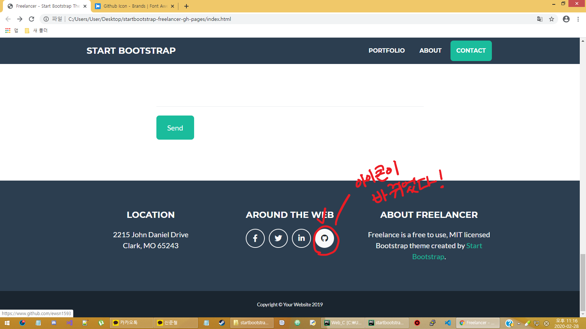  
  
이제 여러분의 자기소개페이지를 마음껏 꾸미시면 됩니다!  
나를 소개할 수 있는 다양한 컨텐츠를 넣어봅시다 :) 
  
## [과제 : github을 웹호스팅으로 이용하기](https://opentutorials.org/course/2473/16117)  
아무리 잘 만든 웹페이지라도 남이 볼 수 없으면 의미가 없겠죠?  
위의 링크를 보고 github의 웹호스팅 서비스를 이용해 남이 접속할 수 있게 해봅시다.  
영상을 보면서 차근차근 따라하면 어렵지 않을겁니다.  
과제를 다하셨다면 issue에 댓글로 자기소개페이지 주소를 달아주시기 바랍니다.
